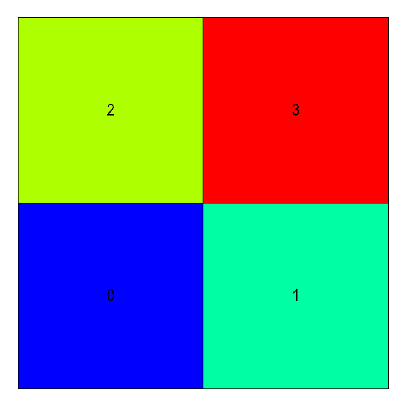
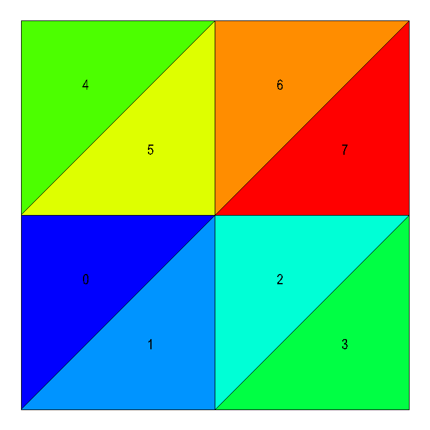
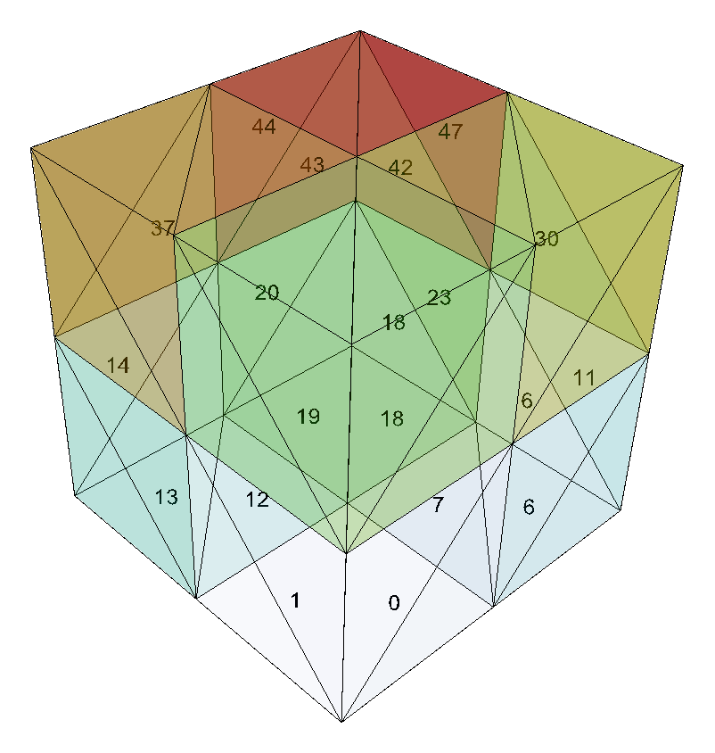
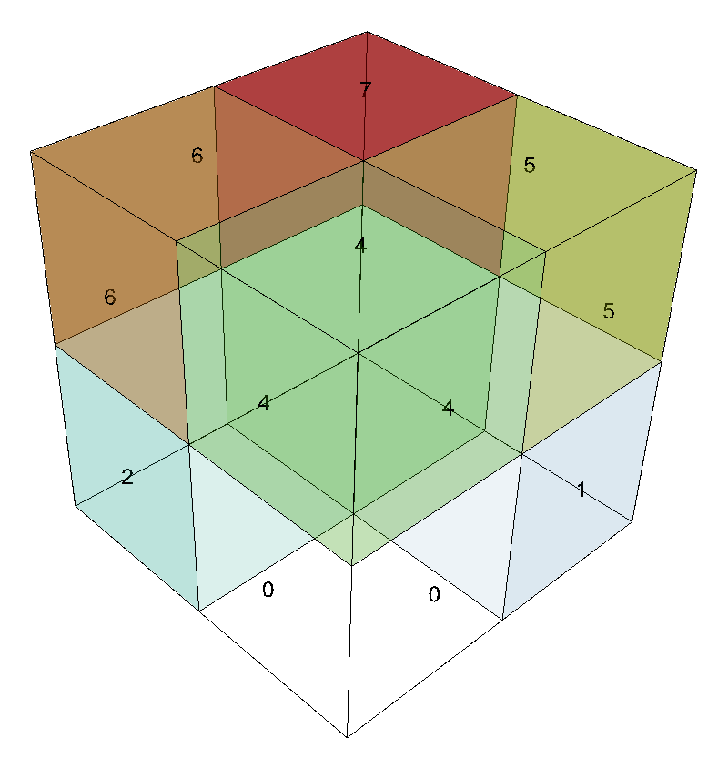

.. ############################################################################
.. # Copyright (c) 2014-2018, Lawrence Livermore National Security, LLC.
.. # 
.. # Produced at the Lawrence Livermore National Laboratory
.. # 
.. # LLNL-CODE-666778
.. # 
.. # All rights reserved.
.. # 
.. # This file is part of Conduit. 
.. # 
.. # For details, see: http://software.llnl.gov/conduit/.
.. # 
.. # Please also read conduit/LICENSE
.. # 
.. # Redistribution and use in source and binary forms, with or without 
.. # modification, are permitted provided that the following conditions are met:
.. # 
.. # * Redistributions of source code must retain the above copyright notice, 
.. #   this list of conditions and the disclaimer below.
.. # 
.. # * Redistributions in binary form must reproduce the above copyright notice,
.. #   this list of conditions and the disclaimer (as noted below) in the
.. #   documentation and/or other materials provided with the distribution.
.. # 
.. # * Neither the name of the LLNS/LLNL nor the names of its contributors may
.. #   be used to endorse or promote products derived from this software without
.. #   specific prior written permission.
.. # 
.. # THIS SOFTWARE IS PROVIDED BY THE COPYRIGHT HOLDERS AND CONTRIBUTORS "AS IS"
.. # AND ANY EXPRESS OR IMPLIED WARRANTIES, INCLUDING, BUT NOT LIMITED TO, THE
.. # IMPLIED WARRANTIES OF MERCHANTABILITY AND FITNESS FOR A PARTICULAR PURPOSE
.. # ARE DISCLAIMED. IN NO EVENT SHALL LAWRENCE LIVERMORE NATIONAL SECURITY,
.. # LLC, THE U.S. DEPARTMENT OF ENERGY OR CONTRIBUTORS BE LIABLE FOR ANY
.. # DIRECT, INDIRECT, INCIDENTAL, SPECIAL, EXEMPLARY, OR CONSEQUENTIAL 
.. # DAMAGES  (INCLUDING, BUT NOT LIMITED TO, PROCUREMENT OF SUBSTITUTE GOODS
.. # OR SERVICES; LOSS OF USE, DATA, OR PROFITS; OR BUSINESS INTERRUPTION)
.. # HOWEVER CAUSED AND ON ANY THEORY OF LIABILITY, WHETHER IN CONTRACT, 
.. # STRICT LIABILITY, OR TORT (INCLUDING NEGLIGENCE OR OTHERWISE) ARISING
.. # IN ANY WAY OUT OF THE USE OF THIS SOFTWARE, EVEN IF ADVISED OF THE 
.. # POSSIBILITY OF SUCH DAMAGE.
.. # 
.. ############################################################################

===================
mesh
===================

Protocol
~~~~~~~~~~~~~~~~~~~~~~~~~~~~

The Blueprint protocol defines a single-domain computational mesh using one or more Coordinate Sets (via child ``coordsets``), one or more Topologies (via child  ``topologies``), zero or more Materials Sets (via child ``matsets``), zero or more Fields (via child ``fields``), optional Adjacency Set information (via child ``adjsets``), and optional State information (via child ``state``).
The protocol defines multi-domain meshes as *Objects* that contain one or more single-domain mesh entries.
For simplicity, the descriptions below are structured relative to a single-domain mesh *Object* that contains one Coordinate Set named ``coords``, one Topology named ``topo``, and one Material Set named ``matset``.

Coordinate Sets
++++++++++++++++++++

To define a computational mesh, the first required entry is a set of spatial coordinate tuples that can underpin a mesh topology.

The mesh blueprint protocol supports sets of spatial coordinates from three coordinate systems:

* Cartesian: {x,y,z}
* Cylindrical: {r,z}
* Spherical: {r,theta,phi}

The mesh blueprint protocol supports three types of Coordinate Sets: ``uniform``, ``rectilinear``, and ``explicit``.  To conform to the protocol, each entry under ``coordsets`` must be an *Object* with entries from one of the cases outlined below: 

* **uniform**

   An implicit coordinate set defined as the cartesian product of i,j,k dimensions starting at an ``origin`` (ex: {x,y,z}) using a given ``spacing`` (ex: {dx,dy,dz}).

  * Cartesian
  
  
    * coordsets/coords/type: “uniform”
    * coordsets/coords/dims/{i,j,k}
    * coordsets/coords/origin/{x,y,z} (optional, default = {0.0, 0.0, 0.0})
    * coordsets/coords/spacing/{dx,dy,dz} (optional, default = {1.0, 1.0, 1.0})

  * Cylindrical
  
  
    * coordsets/coords/type: “uniform”
    * coordsets/coords/dims/{i,j}
    * coordsets/coords/origin/{r,z} (optional, default = {0.0, 0.0})
    * coordsets/coords/spacing/{dr,dz} (optional, default = {1.0, 1.0})

  * Spherical
  
  
    * coordsets/coords/type: “uniform”
    * coordsets/coords/dims/{i,j}
    * coordsets/coords/origin/{r,theta,phi} (optional, default = {0.0, 0.0, 0.0})
    * coordsets/coords/spacing/{dr,dtheta, dphi} (optional, default = {1.0, 1.0, 1.0})

* **rectilinear** 

  An implicit coordinate set defined as the cartesian product of passed coordinate arrays.
  
  * Cartesian
  
  
    * coordsets/coords/type: “rectilinear”
    * coordsets/coords/values/{x,y,z}

  * Cylindrical:
  
    * coordsets/coords/type: “rectilinear”
    * coordsets/coords/values/{r,z}

  * Spherical

    * coordsets/coords/type: “rectilinear”
    * coordsets/coords/values/{r,theta,phi}

* **explicit**

  An explicit set of coordinates, which includes ``values`` that conforms to the  **mcarray** blueprint protocol.

  * Cartesian
  
  
    * coordsets/coords/type: “explicit”
    * coordsets/coords/values/{x,y,z}

  * Cylindrical
  
  
    * coordsets/coords/type: “explicit”
    * coordsets/coords/values/{r,z}

  * Spherical
  
  
    * coordsets/coords/type: “explicit”
    * coordsets/coords/values/{r,theta,phi}

Toplogies
++++++++++++++++++++
The next entry required to describe a computational mesh is its topology. To conform to the protocol, each entry under *topologies* must be an *Object* that contains one of the topology descriptions outlined below.

Topology Nomenclature 
====================================

The mesh blueprint protocol describes meshes in terms of ``vertices``, ``edges``, ``faces``, and ``elements``.

The following element shape names are supported:

====== ================  ===================================================
Name    Geometric Type    Specified By 
====== ================  ===================================================
point   point             an index to a single coordinate tuple
line    line              indices to 2 coordinate tuples
tri     triangle          indices to 3 coordinate tuples
quad    quadrilateral     indices to 4 coordinate tuples
tet     tetrahedron       indices to 4 coordinate tuples
hex     hexahedron        indices to 8 coordinate tuples
====== ================  ===================================================

.. note
   
   The expected index ordering with in an element (also referred to as a winding order) is not specified by the blueprint. 
   In the future, we plan to provide transforms to help convert between orderings, are not likely to specify specific orderings.

.. * future: polygon, polyhedron

Association with a Coordinate Set
====================================

Each topology entry must have a child ``coordset`` with a string that references a valid coordinate set by name.

    * topologies/topo/coordset: "coords"

Optional association with a Grid Function
==========================================

Topologies can optionally include a child ``grid_function`` with a string that references a valid field by name.

    * topologies/topo/grid_function: "gf"

Implicit Topology
===============================

The mesh blueprint protocol accepts four implicit ways to define a topology on a coordinate set. The first simply uses all the points in a given coordinate set and the rest define grids of elements on top of a coordinate set. For the grid cases with a coordinate set with 1D coordinate tuples, *line* elements are used, for sets with 2D coordinate tuples *quad* elements are used, and for 3D coordinate tuples *hex* elements are used.

* **points**: An implicit topology using all of the points in a coordinate set. 
   
   * topologies/topo/coordset: "coords"
   * topologies/topo/type: "points"

* **uniform**: An implicit topology that defines a grid of elements on top of a *uniform* coordinate set. 
   
   * topologies/topo/coordset: "coords"
   * topologies/topo/type: “uniform”
   * topologies/topo/elements/origin/{i0,j0,k0} (optional, default = {0,0,0})
   
* **rectilinear**: An implicit topology that defines a grid of elements on top of a *rectilinear* coordinate set. 
   
   * topologies/topo/coordset: "coords"
   * topologies/topo/type: “rectilinear”
   * topologies/topo/elements/origin/{i0,j0,k0} (optional, default = {0,0,0})
  

.. .. attention::
..    (can we collapse uniform + rectilinear?)
.. * topologies/topo/type: “structured”
.. * topologies/topo/elements/dims: "implicit"
.. * topologies/topo/elements/origin/{i0,j0,k0} (optional, default = {0,0,0})
.. * topologies/coordset: "coords"

* **structured**: An implicit topology that defines a grid of elements on top of an *explicit* coordinate set.
  
  * topologies/topo/coordset: "coords"
  * topologies/topo/type = “structured”
  * topologies/topo/elements/dims/{i,j,k}
  * topologies/topo/elements/origin/{i0,j0,k0} (optional, default = {0,0,0})

Explicit (Unstructured) Topology
=================================

Single Shape Topology
************************

For topologies using a homogenous collection of element shapes (eg: all hexs), the topology can be specified by 
a connectivity array and a shape name.

  * topologies/topo/coordset: "coords"
  * topologies/topo/type: “unstructured”
  * topologies/topo/elements/shape: (shape name)
  * topologies/topo/elements/connectivity: (index array)

Mixed Shape Toplogies 
************************

For topologies using a non-homogenous collections of element shapes (eg: hexs and texs), the topology can 
specified using a single shape topology for each element shape.

* **list** - A Node in the *List* role, that contains a children that conform to the *Single Shape Topology* case. 

* **object** - A Node in the *Object* role, that contains a children that conform to the *Single Shape Topology* case. 

.. note::
   Future version of the mesh blueprint will expand support to include mixed elements types in a single array with related
   index arrays.

Element Windings
^^^^^^^^^^^^^^^^^^^^^^

The mesh blueprint does yet not have a prescribed winding convention (a way to order the association of vertices to elements) or more generally to 
outline a topology's `dimensional cascade`  (how elements are related to faces, faces are related to edges, and edges are related to vertices. )

This is a gap we are working to solve in future versions of the mesh blueprint, with a goal of providing transforms to
help convert between different winding or cascade schemes.

That said VTK (and VTK-m) winding conventions are assumed by MFEM, VisIt, or Ascent when using Blueprint data.

.. * **stream** - (strem description)
..   (specifying stream ids and stream connectivity)
..
..
..   * topologies/topo/elements/element_types: ()
..   * topologies/topo/elements/stream: ()
..
.. Indexed Streams
.. ^^^^^^^^^^^^^^^^^^^
..
.. * Stream of Indexed Elements
..
..
..     * topology/elements/element_types: ()
..     * topology/elements/element_index/stream_ids: ()
..     * topology/elements/element_index/offsets: ()
..     * topology/elements/stream: ()
..
.. * Stream of Contiguous Segments of Element Types
..
..
..     * topology/elements/element_types: ()
..     * topology/elements/segment_index/stream_ids: ()
..     * topology/elements/segment_index/element_counts: ()
..     * topology/elements/stream: ()

Material Sets
++++++++++++++++++++

Materials Sets contain material name and volume fraction information defined over a specified mesh topology.

A material set contains an **mcarray** that houses per-material, per-element volume fractions and a source topology over which these volume fractions are defined.
To conform to protocol, each entry in the ``matsets`` section must be an *Object* that contains the following information:

   * matsets/matset/topology: "topo"
   * matsets/matset/volume_fractions: (mcarray)

Fields
++++++++++++++++++++

Fields are used to hold simulation state arrays associated with a mesh topology and (optionally) a mesh material set.

Each field entry can define an **mcarray** of material-independent values and/or an **mcarray** of per-material values.
These data arrays must be specified alongside a source space, which specifies the space over which the field values are defined (i.e. a topology for material-independent values and a material set for material-dependent values).
Minimally, each field entry must specify one of these data sets, the source space for the data set, an association type (e.g. per-vertex, per-element, or per-grid-function-entity), and a volume scaling type (e.g. volume-dependent, volume-independent).
Thus, to conform to protocol, each entry under the ``fields`` section must be an *Object* that adheres to one of the following descriptions:

 * Material-Independent Fields:

   * fields/field/association: "vertex" | "element" 
   * fields/field/grid_function: (mfem-style finite element collection name) (replaces "association")
   * fields/field/volume_dependent: "true" | "false"
   * fields/field/topology: "topo"
   * fields/field/values: (mcarray)

 * Material-Dependent Fields:

   * fields/field/association: "vertex" | "element"
   * fields/field/grid_function: (mfem-style finite element collection name) (replaces "association")
   * fields/field/volume_dependent: "true" | "false"
   * fields/field/matset: "matset"
   * fields/field/matset_values: (mcarray)

 * Mixed Fields:

   * fields/field/association: "vertex" | "element"
   * fields/field/grid_function: (mfem-style finite element collection name) (replaces "association")
   * fields/field/volume_dependent: "true" | "false"
   * fields/field/topology: "topo"
   * fields/field/values: (mcarray)
   * fields/field/matset: "matset"
   * fields/field/matset_values: (mcarray)

Topology Association for Field Values
======================================

For implicit topologies, the field values are associated with the topology by fast varying logical dimensions starting with ``i``, then ``j``, then ``k``.

For explicit topologies, the field values are associated with the topology by assuming the order of the field values matches the order the elements are defined in the topology. 

Adjacency Sets
++++++++++++++++++++

Adjacency Sets are used to outline the shared geometry between subsets of domains in multi-domain meshes.

Each entry in the Adjacency Sets section is meant to encapsulate a set of adjacency information shared between domains.
Each individual adjacency set contains a source topology, an element association, and a list of adjacency groups.
An adjacency set's contained groups describe adjacency information shared between subsets of domains, which is represented by a subset of adjacent neighbor domains IDs and a list of shared element IDs.
The fully-defined Blueprint schema for the ``adjsets`` entries looks like the following:

   * adjsets/adjset/association: "vertex" | "element"
   * adjsets/adjset/topology: "topo"
   * adjsets/adjset/groups/group/neighbors: (integer array)
   * adjsets/adjset/groups/group/values: (integer array)

State
++++++++++++++++++++

Optional state information is used to provide metadata about the mesh. While the mesh blueprint is focused on describing a single domain of a domain decomposed mesh, the state info can be used to identify a specific mesh domain in the context of a domain decomposed mesh.

To conform, the ``state`` entry must be an *Object* and can have the following optional entries:

   * state/time: (number)
   * state/cycle: (number)
   * state/domain_id: (integer)

Examples
~~~~~~~~~~~~~~~~~~~~~

The C++ ``conduit::blueprint::mesh::examples`` namespace and the Python `conduit.blueprint.mesh.examples` module provide
functions that generate example mesh blueprint data. For details on how to write these data sets to files, see the unit
tests that exercise these examples in ``src/tests/blueprint/t_blueprint_mesh_examples.cpp``. This section outlines the
examples that demonstrate the most commonly used mesh schemas.

gradient
+++++++++

The simplest of the mesh examples, ``gradient()``, generates an homogenous example mesh with a configurable element
representation/type (see the ``mesh_type`` table below) spanned by a single scalar field that contains a unique
identifier for each mesh element. The function that needs to be called to generate an example of this type has the
following signature:

.. code:: cpp

    conduit::blueprint::mesh::examples::gradient(const std::string &mesh_type, // element type/dimensionality
                                                 index_t nx,                   // number of grid points along x
                                                 index_t ny,                   // number of grid points along y
                                                 index_t nz,                   // number of grid points along z (3d only)
                                                 Node &res);                   // result container

The element representation, type, and dimensionality are all configured through the ``mesh_type`` argument. The
supported values for this parameter and their corresponding effects are outlined in the table below:

+---------------+--------------------+-------------------+-------------------+------------------+
| **Mesh Type** | **Dimensionality** | **Coordset Type** | **Topology Type** | **Element Type** |
+---------------+--------------------+-------------------+-------------------+------------------+
| uniform       | 2d/3d              | implicit          | implicit          | quad/hex         |
+---------------+--------------------+-------------------+-------------------+------------------+
|rectilinear    | 2d/3d              | implicit          | implicit          | quad/hex         |
+---------------+--------------------+-------------------+-------------------+------------------+
|structured     | 2d/3d              | explicit          | implicit          | quad/hex         |
+---------------+--------------------+-------------------+-------------------+------------------+
|tris           | 2d                 | explicit          | explicit          | tri              |
+---------------+--------------------+-------------------+-------------------+------------------+
|quads          | 2d                 | explicit          | explicit          | quad             |
+---------------+--------------------+-------------------+-------------------+------------------+
|tets           | 3d                 | explicit          | explicit          | tet              |
+---------------+--------------------+-------------------+-------------------+------------------+
|hexs           | 3d                 | explicit          | explicit          | hex              |
+---------------+--------------------+-------------------+-------------------+------------------+

The remainder of this section demonstrates each of the different ``gradient()`` mesh types, outlining
each type with a simple example that (1) presents the generating call, (2) shows the results of the
call in Blueprint schema form, and (3) displays the corresponding graphical rendering of this schema.

Uniform
====================================

* **Call**

.. literalinclude:: ../../tests/docs/t_conduit_docs_blueprint_demos.cpp
   :lines: 132-137
   :language: cpp
   :dedent: 4

* **Schema**

.. literalinclude:: ../../tests/docs/t_conduit_docs_blueprint_demos.cpp
   :lines: 142-183
   :language: cpp
   :dedent: 4

* **Visual**

    Pseudocolor plot of ``gradient`` (element type 'uniform')

Rectilinear
====================================

* **Call**

.. literalinclude:: ../../tests/docs/t_conduit_docs_blueprint_demos.cpp
   :lines: 205-210
   :language: cpp
   :dedent: 4

* **Schema**

.. literalinclude:: ../../tests/docs/t_conduit_docs_blueprint_demos.cpp
   :lines: 215-246
   :language: cpp
   :dedent: 4

* **Visual**

    Pseudocolor plot of ``gradient`` (element type 'rectilinear')

Structured
====================================

* **Call**

.. literalinclude:: ../../tests/docs/t_conduit_docs_blueprint_demos.cpp
   :lines: 268-273
   :language: cpp
   :dedent: 4

* **Schema**

.. literalinclude:: ../../tests/docs/t_conduit_docs_blueprint_demos.cpp
   :lines: 278-317
   :language: cpp
   :dedent: 4

* **Visual**

    Pseudocolor plot of ``gradient`` (element type 'structured')

Tris
====================================

* **Call**

.. literalinclude:: ../../tests/docs/t_conduit_docs_blueprint_demos.cpp
   :lines: 339-344
   :language: cpp
   :dedent: 4

* **Schema**

.. literalinclude:: ../../tests/docs/t_conduit_docs_blueprint_demos.cpp
   :lines: 349-385
   :language: cpp
   :dedent: 4

* **Visual**

    Pseudocolor plot of ``gradient`` (element type 'tris')

Quads
====================================

* **Call**

.. literalinclude:: ../../tests/docs/t_conduit_docs_blueprint_demos.cpp
   :lines: 407-412
   :language: cpp
   :dedent: 4

* **Schema**

.. literalinclude:: ../../tests/docs/t_conduit_docs_blueprint_demos.cpp
   :lines: 417-453
   :language: cpp
   :dedent: 4

* **Visual**

    Pseudocolor plot of ``gradient`` (element type 'quads')

Tets
====================================

* **Call**

.. literalinclude:: ../../tests/docs/t_conduit_docs_blueprint_demos.cpp
   :lines: 475-480
   :language: cpp
   :dedent: 4

* **Schema**

.. literalinclude:: ../../tests/docs/t_conduit_docs_blueprint_demos.cpp
   :lines: 485-522
   :language: cpp
   :dedent: 4

* **Visual**

    Pseudocolor plot of ``gradient`` (element type 'tets')

Hexs
====================================

* **Call**

.. literalinclude:: ../../tests/docs/t_conduit_docs_blueprint_demos.cpp
   :lines: 544-549
   :language: cpp
   :dedent: 4

* **Schema**

.. literalinclude:: ../../tests/docs/t_conduit_docs_blueprint_demos.cpp
   :lines: 554-591
   :language: cpp
   :dedent: 4

* **Visual**

    Pseudocolor plot of ``gradient`` (element type 'hexs')

braid
++++++

.. figure:: braid_render.png
    :width: 400px
    :align: center

    Pseudocolor plot of a 3D braid example ``braid`` field
    
The ``braid()`` generates example meshes that cover the range of coordinate sets and topologies supported by the Mesh Blueprint.

The example datasets include a vertex-centered scalar field ``braid``, an element-centered scalar field ``radial`` and
a vertex-centered vector field ``vel``.

.. code:: cpp

    conduit::blueprint::mesh::examples::braid(const std::string &mesh_type,
                                              index_t nx,
                                              index_t ny,
                                              index_t nz,
                                              Node &res);

Here is a list of valid strings for the ``mesh_type`` argument:

+---------------+-----------------------------------------------+
| **Mesh Type** | **Description**                               |
+---------------+-----------------------------------------------+
| uniform       | 2d or 3d uniform grid                         |
|               | (implicit coords, implicit topology)          |
+---------------+-----------------------------------------------+
|rectilinear    | 2d or 3d rectilinear grid                     |
|               | (implicit coords, implicit topology)          |
+---------------+-----------------------------------------------+
|structured     | 2d or 3d structured grid                      |
|               | (explicit coords, implicit topology)          |
+---------------+-----------------------------------------------+
|point          | 2d or 3d unstructured mesh of point elements  |
|               | (explicit coords, explicit topology)          |
+---------------+-----------------------------------------------+
|lines          | 2d or 3d unstructured mesh of line elements   |
|               | (explicit coords, explicit topology)          |
+---------------+-----------------------------------------------+
|tris           | 2d unstructured mesh of triangle elements     |
|               | (explicit coords, explicit topology)          |
+---------------+-----------------------------------------------+
|quads          | 2d unstructured mesh of quadrilateral elements|
|               | (explicit coords, explicit topology)          |
+---------------+-----------------------------------------------+
|tets           | 3d unstructured mesh of tetrahedral elements  |
|               | (explicit coords, explicit topology)          |
+---------------+-----------------------------------------------+
|hexs           | 3d unstructured mesh of hexahedral elements   |
|               | (explicit coords, explicit topology)          | 
+---------------+-----------------------------------------------+

``nx``, ``ny``, ``nz`` specify the number of elements in the x, y, and z directions.

``nz`` is ignored for 2d-only examples.

The resulting data is placed the Node ``res``, which is passed in via reference.

spiral
+++++++

.. figure:: spiral_render.png
    :width: 400px
    :align: center

    Pseudocolor and Contour plots of the spiral example ``dist`` field.

The ``sprial()`` function generates a multi-domain mesh composed of 2D square 
domains with the area of successive fibonacci numbers. The result estimates the 
`Golden spiral <https://en.wikipedia.org/wiki/Golden_spiral>`_.

The example dataset provides a vertex-centered scalar field ``dist`` that estimates the distance from 
each vertex to the Golden spiral.

.. code:: cpp

    conduit::blueprint::mesh::examples::spiral(conduit::index_t ndomains,
                                               Node &res);

``ndomains`` specifies the number of domains to generate, which is also the number of entries from fibonacci sequence used.

The resulting data is placed the Node ``res``, which is passed in via reference.

julia
+++++++

.. figure:: julia_render.png
    :width: 350px
    :align: center

    Pseudocolor plot of the julia example ``iter`` field
    

The ``julia()`` function creates a uniform grid that visualizes
`Julia set fractals <https://en.wikipedia.org/wiki/Julia_set>`_.

The example dataset provides an element-centered scalar field ``iter`` that represents the number of iterations
for each point tested or zero if not found in the set.
 

.. code:: cpp

    conduit::blueprint::mesh::examples::julia(index_t nx,
                                              index_t ny,
                                              float64 x_min,
                                              float64 x_max,
                                              float64 y_min,
                                              float64 y_max,
                                              float64 c_re,
                                              float64 c_im,
                                              Node &res);

``nx``, ``ny`` specify the number of elements in the x and y directions.

``x_min``, ``x_max``, ``y_min``, ``y_max`` specify the x and y extents.

``c_re``, ``c_im`` specify real and complex parts of the constant used.

The resulting data is placed the Node ``res``, which is passed in via reference.

.. Properties and Transforms
.. ---------------------------

