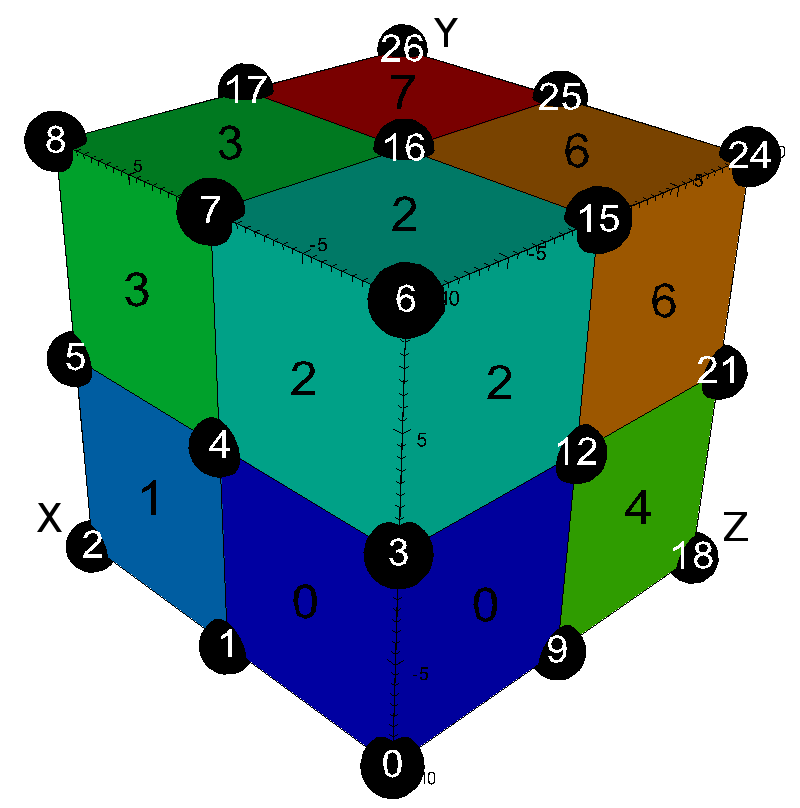
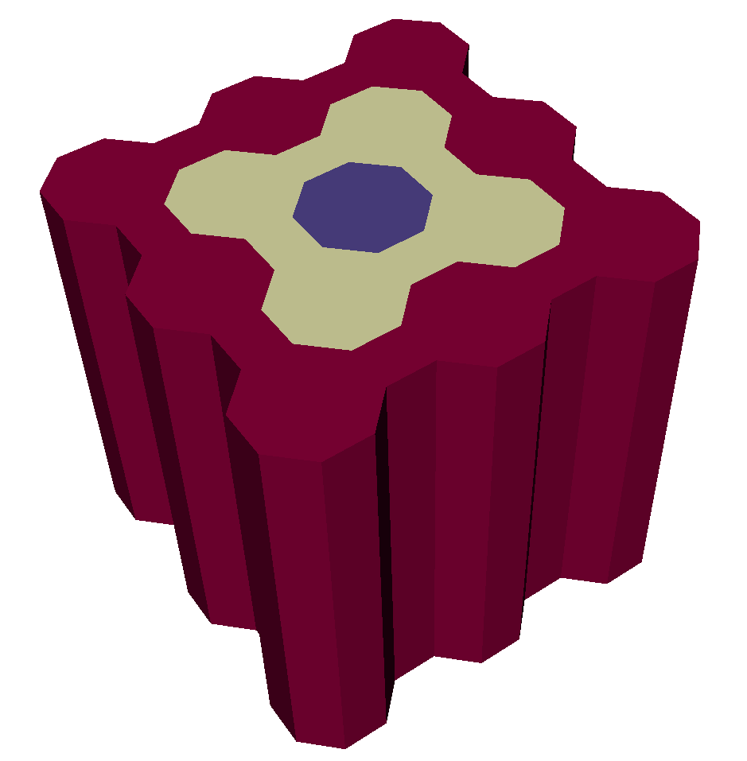

.. # Copyright (c) Lawrence Livermore National Security, LLC and other Conduit
.. # Project developers. See top-level LICENSE AND COPYRIGHT files for dates and
.. # other details. No copyright assignment is required to contribute to Conduit.

.. _mesh_blueprint:

===================
Mesh Blueprint
===================
The Mesh Blueprint is a set of hierarchical conventions to describe mesh-based
simulation data both in-memory and via files. This section provides details
about the Mesh Blueprint. Lots of them.

These docs provide the main reference for all of the components of
the Mesh Blueprint protocol and details about :ref:`examples`
that are included in the Conduit Blueprint Library.

Conduit docs don't have a Mesh Blueprint tutorial yet, if you are looking to
wrap your mind around the basic mechanics of describing a mesh:

* The Ascent tutorial includes section on `creating Meshes using Conduit <https://ascent.readthedocs.io/en/latest/Tutorial_Intro_Conduit_Blueprint.html>`_. This is the best reference for getting started and includes C++ and Python code examples.

* The :ref:`complete_uniform_example` at the end of this section shows you how to create and save a uniform grid to a file which VisIt and `Ascent's Replay utility <https://ascent.readthedocs.io/en/latest/Utilities.html?highlight=replay#replay>`_ can read.

* The :ref:`examples` section details functions that to generate several flavors of exemplar meshes.

Protocol
~~~~~~~~~~~~~~~~~~~~~~~~~~~~

The Blueprint protocol defines a single-domain computational mesh using one or more Coordinate Sets (via child ``coordsets``), one or more Topologies (via child  ``topologies``), zero or more Materials Sets (via child ``matsets``), zero or more Fields (via child ``fields``), optional Adjacency Set information (via child ``adjsets``), and optional State information (via child ``state``).
The protocol defines multi-domain meshes as *Objects* that contain zero or more single-domain mesh entries.

.. note::
   Since the multi-domain protocol accepts zero or more single-domain mesh entries, an empty Conduit Node is
   considered a valid multi-domain mesh. The change to accept an empty Node was introduced in Conduit 0.8.0.
   To check if you have a mesh with data, you can screen with `dtype().is_empty()`, or by using mesh blueprint property
   methods (i.e. `number_of_domains()`).

For simplicity, the descriptions below are structured relative to a single-domain mesh *Object* that contains one Coordinate Set named ``coords``, one Topology named ``topo``, and one Material Set named ``matset``.

Coordinate Sets
++++++++++++++++++++

To define a computational mesh, the first required entry is a set of spatial coordinate tuples that can underpin a mesh topology.

The mesh blueprint protocol supports sets of spatial coordinates from three coordinate systems:

* Cartesian: {x,y,z}
* Cylindrical: {r,z}
* Spherical: {r,theta,phi}

The mesh blueprint protocol supports three types of Coordinate Sets: ``uniform``, ``rectilinear``, and ``explicit``.  To conform to the protocol, each entry under ``coordsets`` must be an *Object* with entries from one of the cases outlined below:

* **uniform**

   An implicit coordinate set defined as the cartesian product of i,j,k dimensions starting at an ``origin`` (ex: {x,y,z}) using a given ``spacing`` (ex: {dx,dy,dz}).

  * Cartesian

    * coordsets/coords/type: “uniform”
    * coordsets/coords/dims/{i,j,k}
    * coordsets/coords/origin/{x,y,z} (optional, default = {0.0, 0.0, 0.0})
    * coordsets/coords/spacing/{dx,dy,dz} (optional, default = {1.0, 1.0, 1.0})

  * Cylindrical

    * coordsets/coords/type: “uniform”
    * coordsets/coords/dims/{i,j}
    * coordsets/coords/origin/{r,z} (optional, default = {0.0, 0.0})
    * coordsets/coords/spacing/{dr,dz} (optional, default = {1.0, 1.0})

  * Spherical

    * coordsets/coords/type: “uniform”
    * coordsets/coords/dims/{i,j}
    * coordsets/coords/origin/{r,theta,phi} (optional, default = {0.0, 0.0, 0.0})
    * coordsets/coords/spacing/{dr,dtheta, dphi} (optional, default = {1.0, 1.0, 1.0})

* **rectilinear**

  An implicit coordinate set defined as the cartesian product of passed coordinate arrays.

  * Cartesian

    * coordsets/coords/type: “rectilinear”
    * coordsets/coords/values/{x,y,z}

  * Cylindrical:

    * coordsets/coords/type: “rectilinear”
    * coordsets/coords/values/{r,z}

  * Spherical

    * coordsets/coords/type: “rectilinear”
    * coordsets/coords/values/{r,theta,phi}

* **explicit**

  An explicit set of coordinates, which includes ``values`` that conforms to the  **mcarray** blueprint protocol.

  * Cartesian

    * coordsets/coords/type: “explicit”
    * coordsets/coords/values/{x,y,z}

  * Cylindrical

    * coordsets/coords/type: “explicit”
    * coordsets/coords/values/{r,z}

  * Spherical

    * coordsets/coords/type: “explicit”
    * coordsets/coords/values/{r,theta,phi}

.. note::
   In all of the coordinate space definitions outlined above, spherical coordinates adhere to the definitions of
   ``theta``/``phi`` used in the physics and engineering domains. Specifically, this means that ``theta`` refers to
   the polar angle of the coordinate (i.e. the angle from the +Z cartesian axis) and ``phi`` refers to the azimuthal
   angle of the coordinate (i.e. the angle from the +X cartesian axis). The figure below most succinctly describes
   these conventions:

   .. figure:: spherical_coordinates_render.png
       :width: 400px
       :align: center

       Figure of ``spherical`` coordinate conventions (courtesy of `Wikipedia <https://en.wikipedia.org/wiki/Spherical_coordinate_system>`_)

Topologies
++++++++++++++++++++
The next entry required to describe a computational mesh is its topology. To conform to the protocol, each entry under *topologies* must be an *Object* that contains one of the topology descriptions outlined below.

Topology Nomenclature
====================================

The mesh blueprint protocol describes meshes in terms of ``vertices``, ``edges``, ``faces``, and ``elements``.

The following element shape names are supported:

========== ================  ===================================================
Name        Geometric Type    Specified By
========== ================  ===================================================
point       point             an index to a single coordinate tuple
line        line              indices to 2 coordinate tuples
tri         triangle          indices to 3 coordinate tuples
quad        quadrilateral     indices to 4 coordinate tuples
tet         tetrahedron       indices to 4 coordinate tuples
hex         hexahedron        indices to 8 coordinate tuples
polygonal   polygon           indices to N end-to-end coordinate tuples
polyhedral  polyhedron        indices to M polygonal faces
mixed       mixed             indices to coordinate tuples and/or polygonal faces
========== ================  ===================================================

.. note
   The expected index ordering with in an element (also referred to as a winding order) is not specified by the blueprint.
   In the future, we plan to provide transforms to help convert between orderings, are not likely to specify specific orderings.
..

.. note
   The ``mixed`` shape is only supported in the unstructured mixed protocol (see below).

Association with a Coordinate Set
====================================

Each topology entry must have a child ``coordset`` with a string that references a valid coordinate set by name.

    * topologies/topo/coordset: "coords"

Optional association with a Grid Function
==========================================

Topologies can optionally include a child ``grid_function`` with a string that references a valid field by name.

    * topologies/topo/grid_function: "gf"

Implicit Topology
===============================

The mesh blueprint protocol accepts four implicit ways to define a topology on a coordinate set. The first simply uses all the points in a given coordinate set and the rest define grids of elements on top of a coordinate set. For the grid cases with a coordinate set with 1D coordinate tuples, *line* elements are used, for sets with 2D coordinate tuples *quad* elements are used, and for 3D coordinate tuples *hex* elements are used.

* **points**: An implicit topology using all of the points in a coordinate set.

   * topologies/topo/coordset: "coords"
   * topologies/topo/type: "points"

* **uniform**: An implicit topology that defines a grid of elements on top of a *uniform* coordinate set.

   * topologies/topo/coordset: "coords"
   * topologies/topo/type: “uniform”
   * topologies/topo/elements/origin/{i,j,k} (optional, default = {0,0,0})

* **rectilinear**: An implicit topology that defines a grid of elements on top of a *rectilinear* coordinate set.

   * topologies/topo/coordset: "coords"
   * topologies/topo/type: “rectilinear”
   * topologies/topo/elements/origin/{i,j,k} (optional, default = {0,0,0})

.. .. attention::
..    (can we collapse uniform + rectilinear?)
.. * topologies/topo/type: “structured”
.. * topologies/topo/elements/dims: "implicit"
.. * topologies/topo/elements/origin/{i,j,k} (optional, default = {0,0,0})
.. * topologies/coordset: "coords"

* **structured**: An implicit topology that defines a grid of elements on top of an *explicit* coordinate set.

  * topologies/topo/coordset: "coords"
  * topologies/topo/type = “structured”
  * topologies/topo/elements/dims/{i,j,k}
  * topologies/topo/elements/origin/{i0,j0,k0} (optional, default = {0,0,0})

Explicit (Unstructured) Topology
=================================

Single Shape Topologies
************************

For topologies using a homogenous collection of element shapes (eg: all hexs), the topology can be specified by
a connectivity array and a shape name.

  * topologies/topo/coordset: "coords"
  * topologies/topo/type: “unstructured”
  * topologies/topo/elements/shape: (shape name)
  * topologies/topo/elements/connectivity: (index array)

Mixed Shape Toplogies
************************

For topologies using a non-homogenous collections of element shapes (eg: hexs and tets), the topology can
specified using a single shape topology for each element shape, or with the mixed shapes protocol.

* **list** - A Node in the *List* role, that contains a children that conform to the *Single Shape Topology* case.

* **object** - A Node in the *Object* role, that contains a children that conform to the *Single Shape Topology* case.

* **shapes** - A Node ``shapes`` that has an ``o2mrelation`` with connectivity (see below).

Element Windings
^^^^^^^^^^^^^^^^^^^^^^

The mesh blueprint does yet not have a prescribed winding convention (a way to order the association of vertices to elements) or more generally to
outline a topology's `dimensional cascade`  (how elements are related to faces, faces are related to edges, and edges are related to vertices. )

This is a gap we are working to solve in future versions of the mesh blueprint, with a goal of providing transforms to
help convert between different winding or cascade schemes.

That said VTK (and VTK-m) winding conventions are assumed by MFEM, VisIt, VTK or Ascent when using Blueprint data.

Polygonal/Polyhedral Topologies
*********************************

The **polygonal** and **polyhedral** topology shape types are structurally
identical to the other explicit topology shape types (see the *Single Shape Topologies*
section above), but the contents of their ``elements`` sections look slightly different.
In particular, these sections are structured as **o2mrelation** objects that map elements
(the *ones*) to their subelement constituents (the *many*). For **polyhedral** topologies,
these constituents reside in an additional ``subelements`` section that specifies
the polyhedral faces in a format identical to ``elements`` in a **polygonal** schema.

Polygonal Topologies
^^^^^^^^^^^^^^^^^^^^^^^

The schema for a **polygonal** shape topology is as follows:

  * topologies/topo/coordset: "coords"
  * topologies/topo/type: “unstructured”
  * topologies/topo/elements: (o2mrelation object)
  * topologies/topo/elements/shape: "polygonal"
  * topologies/topo/elements/connectivity: (index array)

It's important to note that the ``elements/connectivity`` path defines the vertex
index sequences (relative to ``coordset``) for each element in the topology. These
vertex sequences must be arranged end-to-end (i.e. such that ``(v[i], v[i+1])``
defines an edge) relative to their container polygonal elements.

The following diagram illustrates a simple **polygonal** topology:

  .. code:: yaml

      #
      #    4--------5
      #    |`--     |
      # e1 |   `.   | e0
      #    |     --.|
      #    7--------6
      #

      topologies:
        topology:
          coordset: coords
          type: unstructured
          elements:
            shape: polygonal
            connectivity: [4, 6, 5, 7, 6, 4]
            sizes: [3, 3]
            offsets: [0, 3]

Polyhedral Topologies
^^^^^^^^^^^^^^^^^^^^^^^

The schema for a **polyhedral** shape topology is as follows:

  * topologies/topo/coordset: "coords"
  * topologies/topo/type: “unstructured”
  * topologies/topo/elements: (o2mrelation object)
  * topologies/topo/elements/shape: "polyhedral"
  * topologies/topo/elements/connectivity: (index array)
  * topologies/topo/subelements: (o2mrelation object)
  * topologies/topo/subelements/shape: (shape name)
  * topologies/topo/subelements/connectivity: (index array)

An important nuance to the structure of a **polyhedral** shape topology is that
the ``elements/connectivity`` path indexes into the ``subelements`` object to list
the *many* faces associated with each *one* polyhedron. Similarly, the
``subelements/connectivity`` path indexes into the ``coordset`` path to list the
*many* vertices associated with each *one* polyhedral face. There is no assumed
ordering for constituent polyhedral faces relative to their source polyhedra.

The following diagram illustrates a simple **polyhedral** topology:

  .. code:: yaml

      #
      #         0
      #        /|\
      #       / | \ <- e0
      #      /  |  \
      #     /_.-3-._\
      #    1.,  |  ,.4
      #     \ `'2'` /
      #      \  |  /
      # e1 -> \ | /
      #        \|/
      #         5
      #|

      topologies:
        topology:
          coordset: coords
          type: unstructured
          elements:
            shape: polyhedral
            connectivity: [0, 1, 2, 3, 4, 0, 5, 6, 7, 8]
            sizes: [5, 5]
            offsets: [0, 5]
          subelements:
            shape: polygonal
            connectivity: [1, 2, 4, 3, 1, 2, 0, 2, 4, 0, 4, 3, 0, 3, 1, 0, 1, 2, 5, 2, 4, 5, 4, 3, 5, 3, 1, 5]
            sizes: [4, 3, 3, 3, 3, 3, 3, 3, 3]
            offsets: [0, 4, 7, 10, 13, 16, 19, 22, 25]

Mixed topologies with shapes/shape_map
++++++++++++++++++++

The schema for a **mixed** shapes topology is as follows:

  * topologies/topo/coordset: "coords"
  * topologies/topo/coordset: “unstructured”
  * topologies/topo/elements: (o2mrelation object)
  * topologies/topo/elements/shape: "mixed"
  * topologies/topo/elements/shape_map: (shape map node)
  * topologies/topo/elements/shapes : (shapes array)
  * topologies/topo/elements/sizes : (sizes array)
  * topologies/topo/elements/offsets : (offsets array)
  * topologies/topo/elements/connectivity : (connectivity array)
  * topologies/topo/subelements: (o2mrelation object)
  * topologies/topo/subelements/shape: "mixed"
  * topologies/topo/subelements/shape_map: (shape map node)
  * topologies/topo/subelements/shapes : (shapes array)
  * topologies/topo/subelements/sizes : (sizes array)
  * topologies/topo/subelements/offsets : (offsets array)
  * topologies/topo/subelements/connectivity : (connectivity array)

The ``topologies/topo/subelements`` node is optional and only needed if
the ``elements array`` contains polyhedra. The schemas for ``elements``
and ``subelements`` is identical and contains the following items:

``shape_map``, a map that relates known element type strings, e.g. "hex",
"tet" and "quad", to numeric element types in the ``shapes`` arrray:

  * shape_map/hex : (numeric entry for hexahedron, e.g. 12 - VTK_HEXAHEDRON)
  * shape_map/tet : (numeric entry for tetrahedron, e.g. 10 - VTK_TETRA)
  * shape_map/polyhedron : (numeric entry for polyhedron, e.g. 42 - VTK_POLYHEDRON)
  * shape_map/quad : (numeric entry for quadrilateral, e.g. 9 - VTK_QUAD)
  * shape_map/tri : (numeric entry for triangle, e.g. 5 - VTK_TRIANGLE)
  * shape_map/polygon: (numeric entry for polygon, e.g. 7 - VTK_POLYGON)

``shapes`` array contains the numeric element type for each element.

``sizes`` array contains the number of indices in the ``connectivity`` array.

``connectivity`` array contains path the vertex index sequences
(relative to ``coordset``) for each element in the topology. In case of a polyhedral
element, the indices in the ``connectivity`` array indexes into the ``subelements``
array of faces.

.. note::
  The ``mixed`` protocol can be used to specify a mixture of element types. It is recommended
  that the elements of different dimensionality are not used in the same definition, unless
  the downstream processing code can handle this. If topologically 2D and 3D elements need to
  be specified, it is recommended to use two different topologies for this.

Material Sets
++++++++++++++++++++

Materials Sets contain material name and volume fraction information defined over a specified mesh topology.

A material set is a type of **o2mrelation** that houses per-material, per-element volume fractions that are defined over a referenced source topology.
Each material set conforms to a schema variant based on:

 * The layout of its per-material buffers.
 * The indexing scheme used to associate volume fractions with topological elements.

The options for each of these variants are detailed in the following sections.

Material Set Buffer Variants
=================================

Each material set follows one of two variants based on the presented structure of its volume fractions.
These variants cover volume fractions presented in a single, unified buffer (called **uni-buffer** presentation) and in multiple, per-material buffers (called **multi-buffer** presentation).
Both of these variants and their corresponding schemas are outlined in the subsections below.

Uni-Buffer Material Sets
*********************************

A **uni-buffer** material set is one that presents all of its volume fraction data in a single data buffer.
In this case, the material set schema must include this volume fraction data buffer, a parallel buffer associating each volume with a material identifier, and an *Object* that maps human-readable material names to unique integer material identifiers.
Additionally, the top-level of this schema is an **o2mrelation** that sources from the volume fraction/material identifier buffers and targets the material topology.
To conform to protocol, each ``matsets`` child of this type must be an *Object* that contains the following information:

   * matsets/matset/topology: "topo"
   * matsets/matset/material_map: (object with integer leaves)
   * matsets/matset/material_ids: (integer array)
   * matsets/matset/volume_fractions: (floating-point array)

The following diagram illustrates a simple **uni-buffer** material set example:

  .. code:: yaml

      #     z0       z1       z2
      # +--------+--------+--------+
      # | a0     | a1 ___/|        |
      # |___-----|----    |   b2   |
      # |     b0 |     b1 |        |
      # +--------+--------+--------+
      #

      matsets:
        matset:
          topology: topology
          material_map:
            a: 1
            b: 2
            c: 0
          material_ids: [0, 1, 2, 2, 2, 0, 1, 0]
          volume_fractions: [0, a0, b2, b1, b0, 0, a1, 0]
          sizes: [2, 2, 1]
          offsets: [0, 2, 4]
          indices: [1, 4, 6, 3, 2]

Multi-Buffer Material Sets
*********************************

A **multi-buffer** material set is a material set variant wherein the volume fraction data is split such that one buffer exists per material.
The schema for this variant dictates that each material be presented as an *Object* entry of the ``volume_fractions`` field with the material name as the entry key and the material volume fractions as the entry value.
**Multi-buffer** material sets also support an optional ``material_map``, which is an *Object* that maps human-readable material names to unique integer material identifiers.
If omitted, the map from material names to ids is inferred from the order of the material names in the ``volume_fractions`` node.

Optionally, the value for each such entry can be specified as an **o2mrelation** instead of a flat array to enable greater specification flexibility.
To conform to protocol, each ``matsets`` child of this type must be an *Object* that contains the following information:

   * matsets/matset/topology: "topo"
   * matsets/matset/volume_fractions: (object)
   * matsets/matset/material_map: (optional, object with integer leaves)

The following diagram illustrates a simple **multi-buffer** material set example:

  .. code:: yaml

      #     z0       z1       z2
      # +--------+--------+--------+
      # | a0     | a1 ___/|        |
      # |___-----|----    |   b2   |
      # |     b0 |     b1 |        |
      # +--------+--------+--------+
      #

      matsets:
        matset:
          topology: topology
          volume_fractions:
            a:
              values: [0, 0, 0, a1, 0, a0]
              indices: [5, 3]
            b:
              values: [0, b0, b2, b1, 0]
              indices: [1, 3, 2]
          material_map: # (optional)
            a: 0
            b: 1

Material Set Indexing Variants
=================================

Material sets can also vary in how volume fractions are associated with topological elements.
This associative variance leads to two additional schema variants: **element-dominant** (elements/volumes have the same ordering) and **material-dominant** (elements/volumes have independent orderings).
Both of these variants and their corresponding schemas are outlined in the subsections below.

Element-Dominant Material Sets
*********************************

In an **element-dominant** material set, the volume fraction data order matches the topological element order.
In other words, the volume fraction group at ``i`` (e.g. ``matset/volume_fractions/mat[i]``) contains the volume fraction data for topological element ``i``.
This variant is assumed in all material sets that don't have an ``element_ids`` child.

The following diagram illustrates a simple **element-dominant** material set example:

  .. code:: yaml

      #     z0       z1       z2
      # +--------+--------+--------+
      # | a0     | a1 ___/|\___ c2 |
      # |___-----|----    |    ----|
      # |     b0 |     b1 | b2     |
      # +--------+--------+--------+
      #

      matsets:
        matset:
          topology: topology
          volume_fractions:
            a: [a0, a1, 0]
            b: [b0, b1, b2]
            c: [0, 0, c2]
          material_map: # (optional)
            a: 0
            b: 1
            c: 2

Material-Dominant Material Sets
*********************************

In a **material-dominant** material set, the orders for the volume fractions and topological elements are mismatched and need to be bridged via indirection arrays.
For these schemas, the ``element_ids`` field hosts these indirection arrays per material (with just one indirection array for uni-buffer material sets).
In explicit terms, the **material-dominant** volume fraction group at ``i`` (e.g. ``matset/volume_fractions/mat[i]``) contains the volume fraction data for the indirected topological element ``i`` (e.g. ``matset/element_ids/mat[i]``).
Complementary to the **element-dominant** variant, the **material-dominant** variant applies to all material sets that have an ``element_ids`` child.

The following diagram illustrates a simple **material-dominant** material set example:

  .. code:: yaml

      #     z0       z1       z2
      # +--------+--------+--------+
      # | a0     | a1 ___/|\___ c2 |
      # |___-----|----    |    ----|
      # |     b0 |     b1 | b2     |
      # +--------+--------+--------+
      #

      matsets:
        matset:
          topology: topology
          volume_fractions:
            a: [a0, a1]
            b: [b0, b1, b2]
            c: [c2]
          element_ids:
            a: [0, 1]
            b: [0, 1, 2]
            c: [2]
          material_map: # (optional)
            a: 0
            b: 1
            c: 2

Fields
++++++++++++++++++++

Fields are used to hold simulation state arrays associated with a mesh topology and (optionally) a mesh material set.

Each field entry can define an **mcarray** of material-independent values and/or an **mcarray** of per-material values.
These data arrays must be specified alongside a source space, which specifies the space over which the field values are defined (i.e. a topology for material-independent values and a material set for material-dependent values).
Minimally, each field entry must specify one of these data sets, the source space for the data set, an association type (e.g. per-vertex, per-element, or per-grid-function-entity), and a volume scaling type (e.g. volume-dependent, volume-independent).
Thus, to conform to protocol, each entry under the ``fields`` section must be an *Object* that adheres to one of the following descriptions:

 * Material-Independent Fields:

   * fields/field/association: "vertex" | "element"
   * fields/field/grid_function: (mfem-style finite element collection name) (replaces "association")
   * fields/field/volume_dependent: "true" | "false"
   * fields/field/topology: "topo"
   * fields/field/values: (mcarray)

 * Material-Dependent Fields:

   * fields/field/association: "vertex" | "element"
   * fields/field/grid_function: (mfem-style finite element collection name) (replaces "association")
   * fields/field/volume_dependent: "true" | "false"
   * fields/field/matset: "matset"
   * fields/field/matset_values: (mcarray)

 * Mixed Fields:

   * fields/field/association: "vertex" | "element"
   * fields/field/grid_function: (mfem-style finite element collection name) (replaces "association")
   * fields/field/volume_dependent: "true" | "false"
   * fields/field/topology: "topo"
   * fields/field/values: (mcarray)
   * fields/field/matset: "matset"
   * fields/field/matset_values: (mcarray)

Topology Association for Field Values
======================================

For implicit topologies, the field values are associated with the topology by fast varying logical dimensions starting with ``i``, then ``j``, then ``k``.

For explicit topologies, the field values are associated with the topology by assuming the order of the field values matches the order the elements are defined in the topology.

Species Sets
++++++++++++++++++++

Species Sets are a means of representing multi-dimensional per-material quantities, most commonly per-material substance fractions.

Individual Species Sets are entries in the ``specsets`` section of the Blueprint hierarchy, and these entries are formatted in much the same way as ``fields`` entries that describe per-material, multi-dimensional fields.
Just as with this class of ``fields`` entries, each ``specsets`` entry must specify the material set over which it is defined and enumerate its values within an **mcarray** that's organized first by materials (shallower level of nesting) and then by species components (deeper level of nesting).
Additionally, like ``field`` entries, each ``specsets`` item must indicate a volumetric scaling type (e.g. volume-dependent, volume-independent).
To put it in short, each entry in the ``specsets`` section of the Blueprint hierarchy must be an *Object* that follows this template:

 * specsets/specset/volume_dependent: "true" | "false"
 * specsets/specset/matset: "matset"
 * specsets/specset/matset_values: (mcarray)

Nesting Sets
++++++++++++++++++++

Nesting Sets are used to represent the nesting relationships between different domains in multi-domain mesh environments. Most commonly, this subset of the Blueprint specification is used for AMR (adaptive mesh refinement) meshes.

Each entry in the Nesting Sets section contains an independent set of nesting relationships between domains in the described mesh.
On an individual basis, a nesting set contains a source topology, an element association, and a list of nesting windows.
The windows for a particular nesting set describe the topological nesting pattern for a paired set of domains, which includes the ID of the partnered domain, the type of the partnered domain (parent or child), the per-dimension zone ratios of this domain relative to the partnered domain, and the self-relative dimensions and origin (provided in terms of local domain coordinates) of the nesting relationship.
The Blueprint schema for each entry in the ``nestsets`` section matches the following template:

   * nestsets/nestset/association: "vertex" | "element"
   * nestsets/nestset/topology: "topo"
   * nestsets/nestset/windows/window/domain_id: (integer)
   * nestsets/nestset/windows/window/domain_type: "parent" | "child"
   * nestsets/nestset/windows/window/ratio/{i, j, k}
   * nestsets/nestset/windows/window/origin/{i, j, k}
   * nestsets/nestset/windows/window/dims/{i, j, k}

.. note::
   Many structured AMR codes use global coordinate identifiers when specifying
   each window's ``origin``. Such coordinates must be transformed to domain-local
   coordinates to be Blueprint-compliant. Given the global structured origin of
   a window's associated topology ``topo_origin`` (which isn't in the Blueprint,
   but is likely stored somewhere in the client code), the global origin can be
   transformed into a local origin like so:

   .. code:: cpp

       // 'window_origin': starts out as a global index, but is transformed into
       // a domain-local index through this procedure
       conduit::Node &window_origin = // path to nestset/windows/window/origin
       conduit::Node &topo_origin = // loaded from client code; {i, j, k} structure

       conduit::NodeIterator origin_it = window_origin.children();
       while(origin_it.has_next())
       {
           conduit::Node &window_dim = origin_it.next();
           conduit::Node &topo_dim = topo_origin[origin_it.name()];

           conduit::int64 new_dim_val = window_dim.to_int64() - topo_dim.to_int64();
           conduit::Node &new_dim(conduit::DataType::int64(1), &new_dim_val, true);
           new_dim.to_data_type(window_dim.dtype().id(), window_dim);
       }

Each domain that contains a Nesting Sets section must also update its State section to include the domain's global nesting level.
This additional requirement adds the follow constraint to the ``state`` section:

   * state/level_id: (integer)

.. note::
   The Nesting Sets section currently only supports nesting specifications for
   structured topologies. There are plans to extend this feature to support
   unstructured topologies in future versions of Conduit.

Adjacency Sets
++++++++++++++++++++

Adjacency Sets are used to outline the shared geometry between subsets of domains in multi-domain meshes.

Each entry in the Adjacency Sets section is meant to encapsulate a set of adjacency information shared between domains.
Each individual adjacency set contains a source topology, an element association, and a list of adjacency groups.
An adjacency set's contained groups describe adjacency information shared between subsets of domains, which is represented by a subset of adjacent neighbor domains IDs and a list of shared element IDs.
The fully-defined Blueprint schema for the ``adjsets`` entries looks like the following:

   * adjsets/adjset/association: "vertex" | "element"
   * adjsets/adjset/topology: "topo"
   * adjsets/adjset/groups/group/neighbors: (integer array)
   * adjsets/adjset/groups/group/values: (integer array)

It's important to note that the groups in an Adjacency Set associate across domains based on their names (e.g. ``domain0/adjsets/adjset/groups/1`` will be associated with ``domain*/adjsets/adjset/groups/1``).
For data publishers that are agnostic about group names, the ``conduit::blueprint::mesh::utils::adjset::canonicalize`` utility method can be used to assign cross-domain matching names:

.. code:: cpp

   conduit::Node &unidomain_mesh = // loaded from the client code
   conduit::Node &unidomain_adjset = unidomain_mesh["adjsets"].child(0);
   conduit::Node &unidomain_domid = unidomain_mesh["state/domain_id"];

   unidomain_domid.print();
   // > 0
   unidomain_adjset["groups"].print();
   // > a:
   // >   neighbors: [1, 2, 3]
   // >   values: [...]
   // > b:
   // >   neighbors: [1]
   // >   values: [...]
   // > c:
   // >   neighbors: [2]
   // >   values: [...]

   conduit::bleuprint::mesh::utils::adjset::canonicalize(unidomain_adjset);

   unidomain_adjset["groups"].print();
   // > group_0_1_2_3:
   // >   neighbors: [1, 2, 3]
   // >   values: [...]
   // > group_0_1:
   // >   neighbors: [1]
   // >   values: [...]
   // > group_0_2:
   // >   neighbors: [2]
   // >   values: [...]

Adjacency Set Variants
=================================

There's a great deal of flexibility in how the adjacency groups of an Adjacency Set can be constructed.
Blueprint Mesh contains detection and transformation functions for the most commonly targeted formats.
The two variants currently supported are **pairwise** and **max-share**.

Pairwise Adjacency Sets
*********************************

A **pairwise** adjacency set is one that contains groups that represent the relationship between the host domain and a single neighboring domain (i.e. domain "pairs").

The following diagram illustrates a simple **pairwise** material set example:

  .. code:: yaml

      #  domain0    domain1
      # +--------++--------+
      # |     v01||v11     |
      # |        ||        |
      # |     v00||v10     |
      # +--------++--------+
      # +--------+
      # |     v20|
      # |        |
      # |     v21|
      # +--------+
      #  domain2

      domain0:
        state:
          domain_id: 0
        adjsets:
          adjset:
            association: vertex
            topology: topology
            groups:
              domain_0_1:
                neighbors: [1]
                values: [v00, v01]
              domain_0_2:
                neighbors: [2]
                values: [v00]

Max-Share Adjacency Sets
*********************************

A **max-share** adjacency set is one with groups that "maximally share" index data.
In other words, these adjacency sets present index data so that it isn't duplicated between groups.

The following diagram illustrates a simple **max-share** material set example:

  .. code:: yaml

      #  domain0    domain1
      # +--------++--------+
      # |     v01||v11     |
      # |        ||        |
      # |     v00||v10     |
      # +--------++--------+
      # +--------+
      # |     v20|
      # |        |
      # |     v21|
      # +--------+
      #  domain2

      domain0:
        state:
          domain_id: 0
        adjsets:
          adjset:
            association: vertex
            topology: topology
            groups:
              domain_0_1_2:
                neighbors: [1, 2]
                values: [v00]
              domain_0_1:
                neighbors: [1]
                values: [v01]

State
++++++++++++++++++++

Optional state information is used to provide metadata about the mesh. While the mesh blueprint is focused on describing a single domain of a domain decomposed mesh, the state info can be used to identify a specific mesh domain in the context of a domain decomposed mesh.

To conform, the ``state`` entry must be an *Object* and can have the following optional entries:

   * state/time: (number)
   * state/cycle: (number)
   * state/domain_id: (integer)

.. _examples:

Mesh Blueprint Examples
~~~~~~~~~~~~~~~~~~~~~~~~~

The C++ ``conduit::blueprint::mesh::examples`` namespace and the Python ``conduit.blueprint.mesh.examples`` module provide
functions that generate example Mesh Blueprint data. For details on how to write these data sets to files, see the unit
tests that exercise these examples in ``src/tests/blueprint/t_blueprint_mesh_examples.cpp`` and the
`mesh output <Outputting Meshes for Visualization_>`_ example below. This section outlines the examples that demonstrate
the most commonly used mesh schemas.

basic
+++++++++

The simplest of the mesh examples, ``basic()``, generates an homogenous example mesh with a configurable element
representation/type (see the ``mesh_type`` table below) spanned by a single scalar field that contains a unique
identifier for each mesh element. The function that needs to be called to generate an example of this type has the
following signature:

.. code:: cpp

    conduit::blueprint::mesh::examples::basic(const std::string &mesh_type, // element type/dimensionality
                                              index_t nx,                   // number of grid points along x
                                              index_t ny,                   // number of grid points along y
                                              index_t nz,                   // number of grid points along z (3d only)
                                              Node &res);                   // result container

The element representation, type, and dimensionality are all configured through the ``mesh_type`` argument. The
supported values for this parameter and their corresponding effects are outlined in the table below:

+--------------------------------+--------------------+-------------------+-------------------+------------------+
| **Mesh Type**                  | **Dimensionality** | **Coordset Type** | **Topology Type** | **Element Type** |
+--------------------------------+--------------------+-------------------+-------------------+------------------+
| `uniform <Uniform_>`_          | 2d/3d              | implicit          | implicit          | quad/hex         |
+--------------------------------+--------------------+-------------------+-------------------+------------------+
| `rectilinear <Rectilinear_>`_  | 2d/3d              | implicit          | implicit          | quad/hex         |
+--------------------------------+--------------------+-------------------+-------------------+------------------+
| `structured <Structured_>`_    | 2d/3d              | explicit          | implicit          | quad/hex         |
+--------------------------------+--------------------+-------------------+-------------------+------------------+
| `tris <Tris_>`_                | 2d                 | explicit          | explicit          | tri              |
+--------------------------------+--------------------+-------------------+-------------------+------------------+
| `quads <Quads_>`_              | 2d                 | explicit          | explicit          | quad             |
+--------------------------------+--------------------+-------------------+-------------------+------------------+
| `polygons <Polygons_>`_        | 2d                 | explicit          | explicit          | polygon          |
+--------------------------------+--------------------+-------------------+-------------------+------------------+
| `tets <Tets_>`_                | 3d                 | explicit          | explicit          | tet              |
+--------------------------------+--------------------+-------------------+-------------------+------------------+
| `hexs <Hexs_>`_                | 3d                 | explicit          | explicit          | hex              |
+--------------------------------+--------------------+-------------------+-------------------+------------------+
| `wedges <Wedges_>`             | 3d                 | explicit          | explicit          | wedge            |
+--------------------------------+--------------------+-------------------+-------------------+------------------+
| `pyramids <Pyramids_>`_        | 3d                 | explicit          | explicit          | pyramid          |
+--------------------------------+--------------------+-------------------+-------------------+------------------+
| `polyhedra <Polyhedra_>`_      | 3d                 | explicit          | explicit          | polyhedron       |
+--------------------------------+--------------------+-------------------+-------------------+------------------+

The remainder of this section demonstrates each of the different ``basic()`` mesh types, outlining
each type with a simple example that (1) presents the generating call, (2) shows the results of the
call in Blueprint schema form, and (3) displays the corresponding graphical rendering of this schema.

Uniform
====================================

* **Usage Example**

.. literalinclude:: ../../tests/docs/t_conduit_docs_blueprint_demos.cpp
   :start-after: BEGIN_EXAMPLE("blueprint_demo_basic_uniform")
   :end-before:  END_EXAMPLE("blueprint_demo_basic_uniform")
   :language: cpp
   :dedent: 4

* **Result**

.. literalinclude:: t_conduit_docs_blueprint_demos_out.txt
   :start-after: BEGIN_EXAMPLE("blueprint_demo_basic_uniform")
   :end-before:  END_EXAMPLE("blueprint_demo_basic_uniform")
   :language: yaml

* **Visual**

    Pseudocolor plot of ``basic`` (mesh type 'uniform')

Rectilinear
====================================

* **Usage Example**

.. literalinclude:: ../../tests/docs/t_conduit_docs_blueprint_demos.cpp
   :start-after: BEGIN_EXAMPLE("blueprint_demo_basic_rectilinear")
   :end-before:  END_EXAMPLE("blueprint_demo_basic_rectilinear")
   :language: cpp
   :dedent: 4

* **Result**

.. literalinclude:: t_conduit_docs_blueprint_demos_out.txt
   :start-after: BEGIN_EXAMPLE("blueprint_demo_basic_rectilinear")
   :end-before:  END_EXAMPLE("blueprint_demo_basic_rectilinear")
   :language: yaml

* **Visual**

    Pseudocolor plot of ``basic`` (mesh type 'rectilinear')

Structured
====================================

* **Usage Example**

.. literalinclude:: ../../tests/docs/t_conduit_docs_blueprint_demos.cpp
   :start-after: BEGIN_EXAMPLE("blueprint_demo_basic_structured")
   :end-before:  END_EXAMPLE("blueprint_demo_basic_structured")
   :language: cpp
   :dedent: 4

* **Result**

.. literalinclude:: t_conduit_docs_blueprint_demos_out.txt
   :start-after: BEGIN_EXAMPLE("blueprint_demo_basic_structured")
   :end-before:  END_EXAMPLE("blueprint_demo_basic_structured")
   :language: yaml

* **Visual**

    Pseudocolor plot of ``basic`` (mesh type 'structured')

Tris
====================================

* **Usage Example**

.. literalinclude:: ../../tests/docs/t_conduit_docs_blueprint_demos.cpp
   :start-after: BEGIN_EXAMPLE("blueprint_demo_basic_tris")
   :end-before:  END_EXAMPLE("blueprint_demo_basic_tris")
   :language: cpp
   :dedent: 4

* **Result**

.. literalinclude:: t_conduit_docs_blueprint_demos_out.txt
   :start-after: BEGIN_EXAMPLE("blueprint_demo_basic_tris")
   :end-before:  END_EXAMPLE("blueprint_demo_basic_tris")
   :language: yaml

* **Visual**

    Pseudocolor plot of ``basic`` (mesh type 'tris')

Quads
====================================

* **Usage Example**

.. literalinclude:: ../../tests/docs/t_conduit_docs_blueprint_demos.cpp
   :start-after: BEGIN_EXAMPLE("blueprint_demo_basic_quads")
   :end-before:  END_EXAMPLE("blueprint_demo_basic_quads")
   :language: cpp
   :dedent: 4

* **Result**

.. literalinclude:: t_conduit_docs_blueprint_demos_out.txt
   :start-after: BEGIN_EXAMPLE("blueprint_demo_basic_quads")
   :end-before:  END_EXAMPLE("blueprint_demo_basic_quads")
   :language: yaml

* **Visual**

    Pseudocolor plot of ``basic`` (mesh type 'quads')

Polygons
====================================

* **Usage Example**

.. literalinclude:: ../../tests/docs/t_conduit_docs_blueprint_demos.cpp
   :start-after: BEGIN_EXAMPLE("blueprint_demo_basic_polygons")
   :end-before:  END_EXAMPLE("blueprint_demo_basic_polygons")
   :language: cpp
   :dedent: 4

* **Result**

.. literalinclude:: t_conduit_docs_blueprint_demos_out.txt
   :start-after: BEGIN_EXAMPLE("blueprint_demo_basic_polygons")
   :end-before:  END_EXAMPLE("blueprint_demo_basic_polygons")
   :language: yaml

* **Visual**

    Pseudocolor plot of ``basic`` (mesh type 'polygons')

Tets
====================================

* **Usage Example**

.. literalinclude:: ../../tests/docs/t_conduit_docs_blueprint_demos.cpp
   :start-after: BEGIN_EXAMPLE("blueprint_demo_basic_tets")
   :end-before:  END_EXAMPLE("blueprint_demo_basic_tets")
   :language: cpp
   :dedent: 4

* **Result**

.. literalinclude:: t_conduit_docs_blueprint_demos_out.txt
   :start-after: BEGIN_EXAMPLE("blueprint_demo_basic_tets")
   :end-before:  END_EXAMPLE("blueprint_demo_basic_tets")
   :language: yaml

* **Visual**

    Pseudocolor plot of ``basic`` (mesh type 'tets')

Hexs
====================================

* **Usage Example**

.. literalinclude:: ../../tests/docs/t_conduit_docs_blueprint_demos.cpp
   :start-after: BEGIN_EXAMPLE("blueprint_demo_basic_hexs")
   :end-before:  END_EXAMPLE("blueprint_demo_basic_hexs")
   :language: cpp
   :dedent: 4

* **Result**

.. literalinclude:: t_conduit_docs_blueprint_demos_out.txt
   :start-after: BEGIN_EXAMPLE("blueprint_demo_basic_hexs")
   :end-before:  END_EXAMPLE("blueprint_demo_basic_hexs")
   :language: yaml

* **Visual**

    Pseudocolor plot of ``basic`` (mesh type 'hexs')

Wedges
====================================

* **Usage Example**

.. literalinclude:: ../../tests/docs/t_conduit_docs_blueprint_demos.cpp
   :start-after: BEGIN_EXAMPLE("blueprint_demo_basic_hexs")
   :end-before:  END_EXAMPLE("blueprint_demo_basic_hexs")
   :language: cpp
   :dedent: 4

* **Result**

.. literalinclude:: t_conduit_docs_blueprint_demos_out.txt
   :start-after: BEGIN_EXAMPLE("blueprint_demo_basic_hexs")
   :end-before:  END_EXAMPLE("blueprint_demo_basic_hexs")
   :language: yaml

* **Visual**

    Pseudocolor plot of ``basic`` (mesh type 'wedges')

Pyramids
====================================

* **Usage Example**

.. literalinclude:: ../../tests/docs/t_conduit_docs_blueprint_demos.cpp
   :start-after: BEGIN_EXAMPLE("blueprint_demo_basic_hexs")
   :end-before:  END_EXAMPLE("blueprint_demo_basic_hexs")
   :language: cpp
   :dedent: 4

* **Result**

.. literalinclude:: t_conduit_docs_blueprint_demos_out.txt
   :start-after: BEGIN_EXAMPLE("blueprint_demo_basic_hexs")
   :end-before:  END_EXAMPLE("blueprint_demo_basic_hexs")
   :language: yaml

* **Visual**

    Pseudocolor plot of ``basic`` (mesh type 'pyramids')

Polyhedra
====================================

* **Usage Example**

.. literalinclude:: ../../tests/docs/t_conduit_docs_blueprint_demos.cpp
   :start-after: BEGIN_EXAMPLE("blueprint_demo_basic_polyhedra")
   :end-before:  END_EXAMPLE("blueprint_demo_basic_polyhedra")
   :language: cpp
   :dedent: 4

* **Result**

.. literalinclude:: t_conduit_docs_blueprint_demos_out.txt
   :start-after: BEGIN_EXAMPLE("blueprint_demo_basic_polyhedra")
   :end-before:  END_EXAMPLE("blueprint_demo_basic_polyhedra")
   :language: yaml

* **Visual**

    Pseudocolor plot of ``basic`` (mesh type 'polyhedra')

braid
++++++

    Pseudocolor plot of a 3D braid example ``braid`` field

The ``braid()`` generates example meshes that cover the range of coordinate sets and topologies supported by the Mesh Blueprint.

The example datasets include a vertex-centered scalar field ``braid``, an element-centered scalar field ``radial`` and
a vertex-centered vector field ``vel``.

.. code:: cpp

    conduit::blueprint::mesh::examples::braid(const std::string &mesh_type,
                                              index_t nx,
                                              index_t ny,
                                              index_t nz,
                                              Node &res);

Here is a list of valid strings for the ``mesh_type`` argument:

+---------------+-----------------------------------------------+
| **Mesh Type** | **Description**                               |
+---------------+-----------------------------------------------+
| uniform       | 2d or 3d uniform grid                         |
|               | (implicit coords, implicit topology)          |
+---------------+-----------------------------------------------+
| rectilinear   | 2d or 3d rectilinear grid                     |
|               | (implicit coords, implicit topology)          |
+---------------+-----------------------------------------------+
| structured    | 2d or 3d structured grid                      |
|               | (explicit coords, implicit topology)          |
+---------------+-----------------------------------------------+
| point         | 2d or 3d unstructured mesh of point elements  |
|               | (explicit coords, explicit topology)          |
+---------------+-----------------------------------------------+
| lines         | 2d or 3d unstructured mesh of line elements   |
|               | (explicit coords, explicit topology)          |
+---------------+-----------------------------------------------+
| tris          | 2d unstructured mesh of triangle elements     |
|               | (explicit coords, explicit topology)          |
+---------------+-----------------------------------------------+
| quads         | 2d unstructured mesh of quadrilateral elements|
|               | (explicit coords, explicit topology)          |
+---------------+-----------------------------------------------+
| tets          | 3d unstructured mesh of tetrahedral elements  |
|               | (explicit coords, explicit topology)          |
+---------------+-----------------------------------------------+
| hexs          | 3d unstructured mesh of hexahedral elements   |
|               | (explicit coords, explicit topology)          |
+---------------+-----------------------------------------------+
| wedges        | 3d unstructured mesh of wedge elements        |
|               | (explicit coords, explicit topology)          |
+---------------+-----------------------------------------------+
| pyramids      | 3d unstructured mesh of pyramid elements      |
|               | (explicit coords, explicit topology)          |
+---------------+-----------------------------------------------+
| mixed_2d      | 2d unstructured mesh of mixed elements        |
|               | (explicit coords, explicit topology)          |
+---------------+-----------------------------------------------+
| mixed         | 3d unstructured mesh of mixed elements        |
|               | (explicit coords, explicit topology)          |
+---------------+-----------------------------------------------+

``nx``, ``ny``, ``nz`` specify the number of elements in the x, y, and z directions.

``nz`` is ignored for 2d-only examples.

The resulting data is placed the Node ``res``, which is passed in via reference.

spiral
+++++++

    Pseudocolor and Contour plots of the spiral example ``dist`` field.

The ``sprial()`` function generates a multi-domain mesh composed of 2D square
domains with the area of successive fibonacci numbers. The result estimates the
`Golden spiral <https://en.wikipedia.org/wiki/Golden_spiral>`_.

The example dataset provides a vertex-centered scalar field ``dist`` that estimates the distance from
each vertex to the Golden spiral.

.. code:: cpp

    conduit::blueprint::mesh::examples::spiral(conduit::index_t ndomains,
                                               Node &res);

``ndomains`` specifies the number of domains to generate, which is also the number of entries from fibonacci sequence used.

The resulting data is placed the Node ``res``, which is passed in via reference.

julia
+++++++

    Pseudocolor plot of the julia example ``iter`` field

The ``julia()`` function creates a uniform grid that visualizes
`Julia set fractals <https://en.wikipedia.org/wiki/Julia_set>`_.

The example dataset provides an element-centered scalar field ``iter`` that represents the number of iterations
for each point tested or zero if not found in the set.

.. code:: cpp

    conduit::blueprint::mesh::examples::julia(index_t nx,
                                              index_t ny,
                                              float64 x_min,
                                              float64 x_max,
                                              float64 y_min,
                                              float64 y_max,
                                              float64 c_re,
                                              float64 c_im,
                                              Node &res);

``nx``, ``ny`` specify the number of elements in the x and y directions.

``x_min``, ``x_max``, ``y_min``, ``y_max`` specify the x and y extents.

``c_re``, ``c_im`` specify real and complex parts of the constant used.

The resulting data is placed the Node ``res``, which is passed in via reference.

julia amr examples
++++++++++++++++++++

We also provide examples that represent the julia set using AMR meshes. These functions provide concrete examples of the Mesh Blueprint `nestset` protocol for patch-based AMR meshes.

    Pseudocolor, Mesh, and Domain Boundary plots of the julia_nestsets_simple example.

.. code:: cpp

    conduit::blueprint::mesh::examples::julia_nestsets_simple(float64 x_min,
                                                              float64 x_max,
                                                              float64 y_min,
                                                              float64 y_max,
                                                              float64 c_re,
                                                              float64 c_im,
                                                              Node &res);

`julia_nestsets_simple` provides a basic AMR example with two levels and one
parent/child nesting relationship.

``x_min``, ``x_max``, ``y_min``, ``y_max`` specify the x and y extents.

``c_re``, ``c_im`` specify real and complex parts of the constant used.

The resulting data is placed the Node ``res``, which is passed in via reference.

.. figure:: julia_nestsets_complex.png
    :width: 350px
    :align: center

    Pseudocolor, Mesh, and Domain Boundary plots of the julia_nestsets_complex example.

.. code:: cpp

    conduit::blueprint::mesh::examples::julia_nestsets_complex(index_t nx,
                                                               index_t ny,
                                                               float64 x_min,
                                                               float64 x_max,
                                                               float64 y_min,
                                                               float64 y_max,
                                                               float64 c_re,
                                                               float64 c_im,
                                                               index_t levels,
                                                               Node &res);

`julia_nestsets_complex` provides an AMR example that refines the mesh
using more resolution in complex areas.

``nx``, ``ny`` specify the number of elements in the x and y directions.

``x_min``, ``x_max``, ``y_min``, ``y_max`` specify the x and y extents.

``c_re``, ``c_im`` specify real and complex parts of the constant used.

``levels`` specifies the number of refinement levels to use.

The resulting data is placed the Node ``res``, which is passed in via reference.

venn
+++++++

    Pseudocolor plot of the venn example ``overlap`` field

The ``venn()`` function creates meshes that use three overlapping circle regions, demonstrating different ways to encode volume fraction based multi-material fields. The volume fractions are provided as both standard fields and using the Material sets (``matsets``) Blueprint. It also creates other fields related to overlap pattern.

.. code:: cpp

    conduit::blueprint::mesh::examples::venn(const std::string &matset_type,
                                             index_t nx,
                                             index_t ny,
                                             float64 radius,
                                             Node &res);

``matset_type`` specifies the style of matset generated by the example.

Here is a list of valid strings for the ``matset_type`` argument:

.. list-table::
   :widths: 10 15
   :header-rows: 1

   * - **Matset Type**
     - **Description**

   * - full
     - non-sparse volume fractions and matset values

   * - sparse_by_material
     - sparse (material dominant) volume fractions and matset values

   * - sparse_by_element
     - sparse (element dominant) volume fractions and matset values

``nx``, ``ny`` specify the number of elements in the x and y directions.

``radius`` specifies the radius of the three circles.

The resulting data is placed the Node ``res``, which is passed in via reference.

polytess
++++++++++

    Pseudocolor plot of the polytess example ``level`` field, with ``nz`` = 1.

.. figure:: polytess_3d_render.png
    :width: 400px
    :align: center

    Pseudocolor plot of the polytess example ``level`` field, with ``nz`` = 2.

    Pseudocolor plot of the polytess example ``level`` field, with ``nz`` = 10.

    Pseudocolor plot of the polytess example ``level`` field, with ``nz`` = 6.

The ``polytess()`` function generates a polygonal tessellation in the 2D
plane comprised of octagons and squares (known formally as a `two-color
truncated square tiling <https://en.wikipedia.org/wiki/Truncated_square_tiling>`_).
This can be extended into 3D using the ``nz`` parameter, which, if greater than 1,
will stack polytessalations on top of one another as follows: first, a polytess is
placed into 3D space, and then a copy of it is placed into a plane parallel to the
original. Then "walls" are added, and finally polyhedra are specified that use
faces from the original polytess, the reflected copy, and the walls. An ``nz`` value
of 3 or more will simply add layers to this setup, essentially stacking "sheets" of
polytess on top of one another.

The scalar element-centered field ``level`` defined in the result mesh associates each element with its
topological distance from the center of the tessellation.

.. code:: cpp

    conduit::blueprint::mesh::examples::polytess(index_t nlevels,
                                                 index_t nz,
                                                 Node &res);

``nlevels`` specifies the number of tessellation levels/layers to generate. If this value is specified
as 1 or less, only the central tessellation level (i.e. the octagon in the center of the geometry) will
be generated in the result.

The resulting data is placed the Node ``res``, which is passed in via reference.

polychain
++++++++++

    Pseudocolor plot of the polyhedral chain example ``chain`` field.

The ``polychain()`` function generates a chain of cubes and triangular prisms that extends diagonally.

The scalar element-centered field ``chain`` defined in the result mesh associates with each cube
the value 0 and with each triangular prism the value 1.

.. code:: cpp

    conduit::blueprint::mesh::examples::polychain(const index_t length,
                                                  Node &res);

``length`` specifies how long the chain ought to be. The length is equal to the number of cubes and
equal to half the number of prisms.

The resulting data is placed the Node ``res``, which is passed in via reference.

miscellaneous
++++++++++++++

This section doesn't overview any specific example in the ``conduit::blueprint::mesh::examples`` namespace,
but rather provides a few additional code samples to help with various common tasks. Each subsection covers
a specific task and presents how it can be accomplished using a function or set of functions in Conduit
and/or the Mesh Blueprint library.

Outputting Meshes for Visualization
====================================

Suppose that you have an arbitrary Blueprint mesh that you want to output from a running code and
subsequently visualize using a visualization tool (e.g. `VisIt <https://visit.llnl.gov>`_).
You can save your mesh to a set of files, using one of the following
``conduit::relay::io::blueprint`` library functions:

Save a mesh to disk:

.. code:: cpp

    conduit::relay::io::blueprint::write_mesh(const conduit::Node &mesh,
                                              const std::string &path);

Save a mesh to disk using a specific protocol:

.. code:: cpp

    conduit::relay::io::blueprint::write_mesh(const conduit::Node &mesh,
                                              const std::string &protocol,
                                              const std::string &path);

Save a mesh to disk using a specific protocol and options:

.. code:: cpp

    /// Options accepted via the `opts` Node argument:
    ///
    ///      file_style: "default", "root_only", "multi_file"
    ///            when # of domains == 1,  "default"   ==> "root_only"
    ///            else,                    "default"   ==> "multi_file"
    ///
    ///      suffix: "default", "cycle", "none"
    ///            when # of domains == 1,  "default"   ==> "none"
    ///            else,                    "default"   ==> "cycle"
    ///
    ///      mesh_name:  (used if present, default ==> "mesh")
    ///
    ///      number_of_files:  {# of files}
    ///            when "multi_file":
    ///                 <= 0, use # of files == # of domains
    ///                  > 0, # of files == number_of_files
    ///
    conduit::relay::io::blueprint::write_mesh(const conduit::Node &mesh,
                                              const std::string &path,
                                              const std::string &protocol,
                                              const conduit::Node &opts);

Loading Meshes from Files
==========================

If you have a mesh written to a set of blueprint files, you can load them by
passing the root file path to the following ``conduit::relay::io::blueprint``
library functions:

Load a mesh given a root file:

.. code:: cpp

    conduit::relay::io::blueprint::read_mesh(const std::string &root_file_path,
                                             conduit::Node &mesh);

Load a mesh given a root file and options:

.. code:: cpp

    /// Options accepted via the `opts` Node argument:
    ///
    ///      mesh_name: "{name}"
    ///          provide explicit mesh name, for cases where bp data includes
    ///           more than one mesh.
    ///
    conduit::relay::io::blueprint::read_mesh(const std::string &root_file_path,
                                             const conduit::Node &opts,
                                             conduit::Node &mesh);

.. _complete_uniform_example:

Complete Uniform Example
====================================

This snippet provides a complete C++ example that demonstrates:

  * Describing a single-domain uniform mesh in a Conduit tree
  * Verifying the tree conforms to the Mesh Blueprint
  * Saving the result to a file that VisIt and Ascent Replay can open

.. literalinclude:: ../../tests/docs/t_conduit_docs_blueprint_demos.cpp
   :start-after: BEGIN_EXAMPLE("blueprint_demo_basic_uniform_complete")
   :end-before:  END_EXAMPLE("blueprint_demo_basic_uniform_complete")
   :language: cpp
   :dedent: 4

Expressions (Derived Fields)
============================

An *expression* is a mathematical formula which defines a new field in terms of other fields and/or
other expressions. Expressions are specified in the ``expressions`` section of the Blueprint
protocol. The ``expressions`` section is optional. When it exists, it is a peer to the ``fields`` section.
It is a list of *Objects* of the form:

* expressions/expression/number_of_components
* expressions/expression/topology
* expressions/expression/definition

The ``number_of_components`` and ``topology`` entries are identical to their meaning as
entries in the ``fields`` section.

The ``definition`` entry is string valued and holds the expression (e.g. *mathematical formula*) defining
how the new field is computed. Blueprint does not interpret this string. It simply passes it along for
downstream consumers that have the ability to interpret the string and perform the associated operations
to compute the expression.

If the expected consumer is `VisIt <https://visit.llnl.gov>`_, data producers may wish to consult the
`Expressions chapter of the VisIt user's manual <https://visit-sphinx-github-user-manual.readthedocs.io/en/develop/gui_manual/Quantitative/Expressions.html#built-in-expressions>`_.
In addition, data producers should *escape* all names of fields or expressions by bracketing
them in ``<`` and ``>`` characters. An example expressions entry in the index is

  .. code:: json

      "fields":
      {
        "braid":
        {
          ...
        },
        "radial":
        {
          ...
        },
      "expressions":
      {
        "scalar_expr":
        {
          "number_of_components": 1,
          "topology": "mesh",
          "definition": "<vector_expr>[1]"
        },
        "vector_expr":
        {
          "number_of_components": 2,
          "topology": "mesh",
          "definition": "{<braid>,recenter(<radial>,\"nodal\")}"
        }
      }

.. Properties and Transforms
.. ---------------------------

