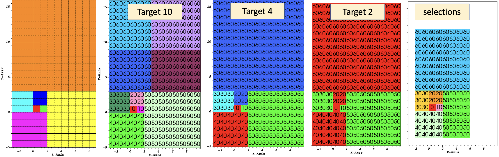

.. # Copyright (c) Lawrence Livermore National Security, LLC and other Conduit
.. # Project developers. See top-level LICENSE AND COPYRIGHT files for dates and
.. # other details. No copyright assignment is required to contribute to Conduit.

.. _mesh_blueprint_partition:

===================
Partitioning
===================
Partitioning meshes is commonly needed in order to evenly distribute work 
among many simulation ranks. Blueprint provides two ``partition()`` functions
that can be used to split or recombine Blueprint meshes in serial or parallel.
Full M:N repartioning is supported. The ``partition()`` functions are in the
serial and parallel Blueprint libraries, respectively.

.. code:: cpp

    // Serial
    void conduit::blueprint::mesh::partition(const Node &mesh,
                                             const Node &options,
                                             Node &output);

    // Parallel
    void conduit::blueprint::mpi::mesh::partition(const Node &mesh,
                                                  const Node &options,
                                                  Node &output,
                                                  MPI_Comm comm);

Partitioning meshes using Blueprint will use any options present to determine
how the partitioning process will behave. Typically, a caller would pass options
containing selections if pieces of domains are desired. The partitioner processes
any selections and then examines the desired target number of domains and will then
decide whether domains must be moved among ranks (only in parallel version) and 
then locally combined to achieve the target number of domains. The combining
process will attempt to preserve the input topology type for the output topology.
However, in cases where lower topologies cannot be used, the algorithm will promote
the extracted domain parts towards more general topologies and use the one most
appropriate to contain the inputs.

In parallel, the ``partition()`` function will make an effort to redistribute data across MPI
ranks to attempt to balance how data are assigned. Domains produced from selections
are assigned round-robin across ranks from rank 0 through rank N-1 until all 
domains have been assigned. This assignment is carried out after extracting 
selections locally so they can be restributed among ranks
before being combined into the target number of domains.

    Partition used to re-partition a 7 domain mesh (left) to different target numbers of domains and to isolate logical subsets.

Options
~~~~~~~
The ``partition()`` functions accept a node containing options. The options node
can be empty and all options are optional. If no options are given, each input mesh
domain will be fully selected. It is more useful to pass selections as part of the
option node with additional options that tell the algorithm how to split or combine
the inputs. If no selections are present in the options node then the partitioner
will create selections of an  appropriate type that selects all elements in each
input domain.

The ``target`` option is useful for setting the target number of domains in the
final output mesh. If the target value is larger than the number of input domains
or selections then the mesh will be split to achieve that target number of domains.
This may require further subdividing selections. Alternatively, if the target is
smaller than the number of selections then the selections will be combined to
yield the target number of domains. The combining is done such that smaller element
count domains are combined first.

.. tabularcolumns:: |p{1.5cm}|p{4cm}|L|

+------------------+-----------------------------------------+------------------------------------------+
| **Option**       | **Description**                         | **Example**                              |
+------------------+-----------------------------------------+------------------------------------------+
| selections       | A list of selection objects that        | .. code:: yaml                           |
|                  | identify regions of interest from the   |                                          |
|                  | input domains. Selections can be        |    selections:                           |
|                  | different on each MPI rank.             |      -                                   |
|                  |                                         |       type: logical                      |
|                  |                                         |       start: [0,0,0]                     |
|                  |                                         |       end: [9,9,9]                       |
|                  |                                         |       domain_id: 10                      |                     
+------------------+-----------------------------------------+------------------------------------------+
| target           | An optional integer that determines the | .. code:: yaml                           |
|                  | fields containing original domains and  |                                          |
|                  | number of domains in the output. If     |    target: 4                             |
|                  | given, the value must be greater than 0.|                                          |
|                  | Values larger than the number of        |                                          |
|                  | selections cause domains to be split.   |                                          |
|                  | Values smaller than the number of       |                                          |
|                  | selections cause domains to be combined.|                                          |
|                  | Invalid values are ignored.             |                                          |
|                  |                                         |                                          |
|                  | If not given, the output will contain   |                                          |
|                  | the number of selections. In parallel,  |                                          |
|                  | the largest target value from the ranks |                                          |
|                  | will be used for all ranks.             |                                          |
+------------------+-----------------------------------------+------------------------------------------+
| fields           | An list of strings that indicate the    | .. code:: yaml                           |
|                  | names of the fields to extract in the   |                                          |
|                  | output. If this option is not provided, |    fields: ["dist", "pressure"]          |
|                  | all fields will be extracted.           |                                          |
+------------------+-----------------------------------------+------------------------------------------+
| mapping          | An integer that determines whether      | .. code:: yaml                           |
|                  | fields containing original domains and  |                                          |
|                  | ids will be added in the output. These  |    mapping: 0                            |
|                  | fields enable one to know where each    |                                          |
|                  | vertex and element came from originally.|                                          |
|                  | Mapping is on by default. A non-zero    |                                          |
|                  | value turns it on and a zero value turns|                                          |
|                  | it off.                                 |                                          |
+------------------+-----------------------------------------+------------------------------------------+
| merge_tolerance  | A double value that indicates the max   | .. code:: yaml                           |
|                  | allowable distance between 2 points     |                                          |
|                  | before they are considered to be        |    merge_tolerance: 0.000001             |
|                  | separate. 2 points spaced smaller than  |                                          |
|                  | this distance will be merged when       |                                          |
|                  | explicit coordsets are combined.        |                                          |
+------------------+-----------------------------------------+------------------------------------------+

Selections
~~~~~~~~~~~~
Selections can be specified in the options for the ``partition()`` function to
select regions of interest that will participate in mesh partitioning. If
selections are not used then all elements from the input meshes will be 
selected to partitipate in the partitioning process. Selections can be further
subdivided if needed to arrive at the target number of domains. Selections can
target specific domains and topologies as well. If a selection does not apply
to the input mesh domains then no geometry is produced in the output for that
selection.

The ``partition()`` function's options support 4 types of selections:

.. tabularcolumns:: |p{1.5cm}|p{2cm}|L|

=============== =============================== =============================================
Selection Type  Topologies                      Description
=============== =============================== =============================================
logical          uniform,rectilinear,structured Identifies start and end logical IJK ranges to select sub-bricks of uniform, rectilinear, or structured topologies. This selection is not compatible with other topologies.
explicit         all                            Identifies an explicit list of element ids and it works with all topologies.
range            all                            Identifies ranges of element ids, provided as pairs so the user can select multiple contiguous blocks of elements. This selection works with all topologies
field            all                            Uses a specified field to indicate destination domain for each element.
=============== =============================== =============================================

By default, a selection does not apply to any specific domain_id. A list of
selections applied to a single input mesh will extract multiple new domains from
that original input mesh. Since meshes are composed of many domains in practice,
selections can also be associated with certain domain_id values. Selections that
provide a domain_id value will only match domains that either have a matching
state/domain_id value or match its index in the input node's list of children
(if state/domain_id is not present).

Selections can apply to certain topology names as well. By default, the first
topology is used but if the ``topology`` name is provided then the selection will
operate on the specified topology only.

+------------------+-----------------------------------------+------------------------------------------+
| **Option**       | **Description**                         | **Example**                              |
+------------------+-----------------------------------------+------------------------------------------+
| type             | The selection type                      | .. code:: yaml                           |
|                  |                                         |                                          |
|                  |                                         |    selections:                           |
|                  |                                         |      -                                   |
|                  |                                         |       type: logical                      |
+------------------+-----------------------------------------+------------------------------------------+
| domain_id        | The domain_id to which the selection    | .. code:: yaml                           |
|                  | will apply. This is almost always an    |                                          |
|                  | unsigned integer value.                 |    selections:                           |
|                  |                                         |      -                                   |
|                  |                                         |       type: logical                      |
|                  |                                         |       domain_id: 10                      |
|                  |                                         |                                          |
|                  |                                         | .. code:: yaml                           |
|                  |                                         |                                          |
|                  | For field selections, domain_id is      |    selections:                           |
|                  | allowed to be a string "any" so a single|      -                                   |
|                  | selection can apply to many domains.    |       type: logical                      |
|                  |                                         |       domain_id: any                     |
|                  |                                         |                                          |
+------------------+-----------------------------------------+------------------------------------------+
| topology         | The topology to which the selection     | .. code:: yaml                           |
|                  | will apply.                             |                                          |
|                  |                                         |    selections:                           |
|                  |                                         |      -                                   |
|                  |                                         |       type: logical                      |
|                  |                                         |       domain_id: 10                      |
|                  |                                         |       topology: mesh                     |
+------------------+-----------------------------------------+------------------------------------------+

Logical Selection
*****************
The logical selection allows the partitioner to extract a logical IJK subset from uniform, rectilinear,
or structured topologies. The selection is given as IJK start and end values. If the end values extend
beyond the actual mesh's logical extents, they will be clipped. The partitioner may
automatically subdivide logical selections into smaller logical selections, if needed,
preserving the logical structure of the input topology into the output.

.. code:: yaml

  selections:
    -
     type: logical
     start: [0,0,0]
     end: [9,9,9]

Explicit Selection
******************
The explicit selection allows the partitioner to extract a list of elements.
This is used when the user wants to target a specific set of elements.
The output will result in an explicit topology.

.. code:: yaml

  selections:
    -
     type: explicit
     elements: [0,1,2,3,100,101,102]

Range Selection
***************
The range selection is similar to the explicit selection except that it identifies
ranges of elements using pairs of numbers. The list of ranges must be a multiple of
2 in length. The output will result in an explicit topology.

.. code:: yaml

  selections:
    -
     type: range
     range: [0,3,100,102]

Field Selection
***************
The field selection enables the partitioner to use partitions done by other tools
using a field on the mesh as the source of the final domain number for each element.
The field must be associated with the mesh elements. When using a field selection,
the partitioner will make a best attempt to use the domain numbers to extract
mesh pieces and reassemble them into domains with those numberings. If a larger
target value is specified, then field selections can sometimes be partitioned further
as explicit partitions. The field selection is unique in that its ``domain_id`` value
can be set to "any" if it is desired that the field selection will be applied to
all domains in the input mesh. The domain_id value can still be set to specific
integer values to limit the set of domains over which the selection will be applied.

.. code:: yaml

  selections:
    -
     type: field
     domain_id: any
     field: fieldname
