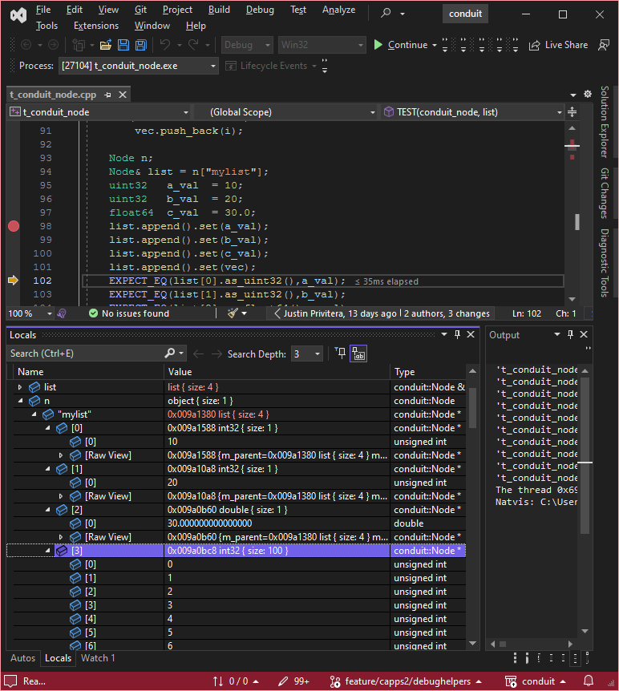
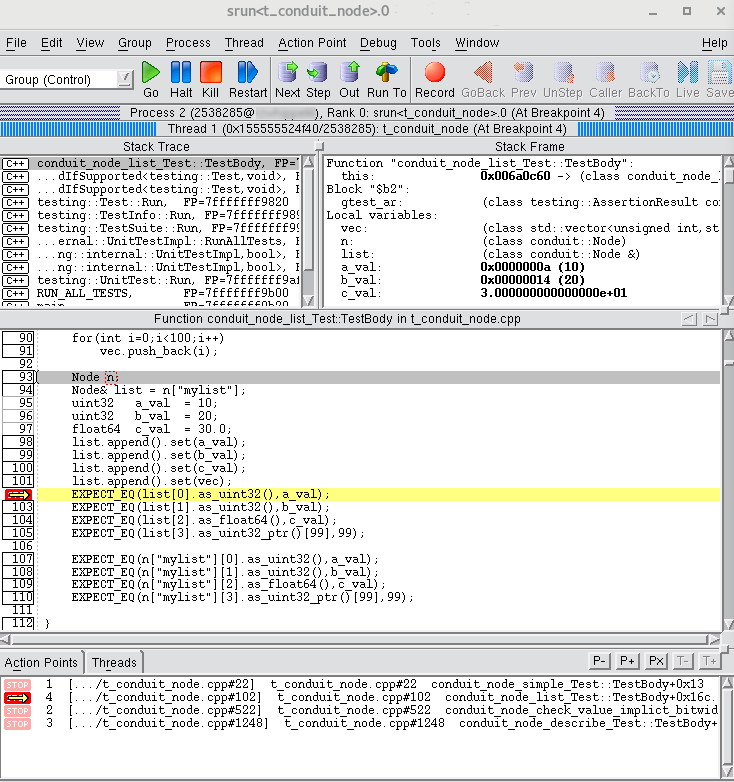
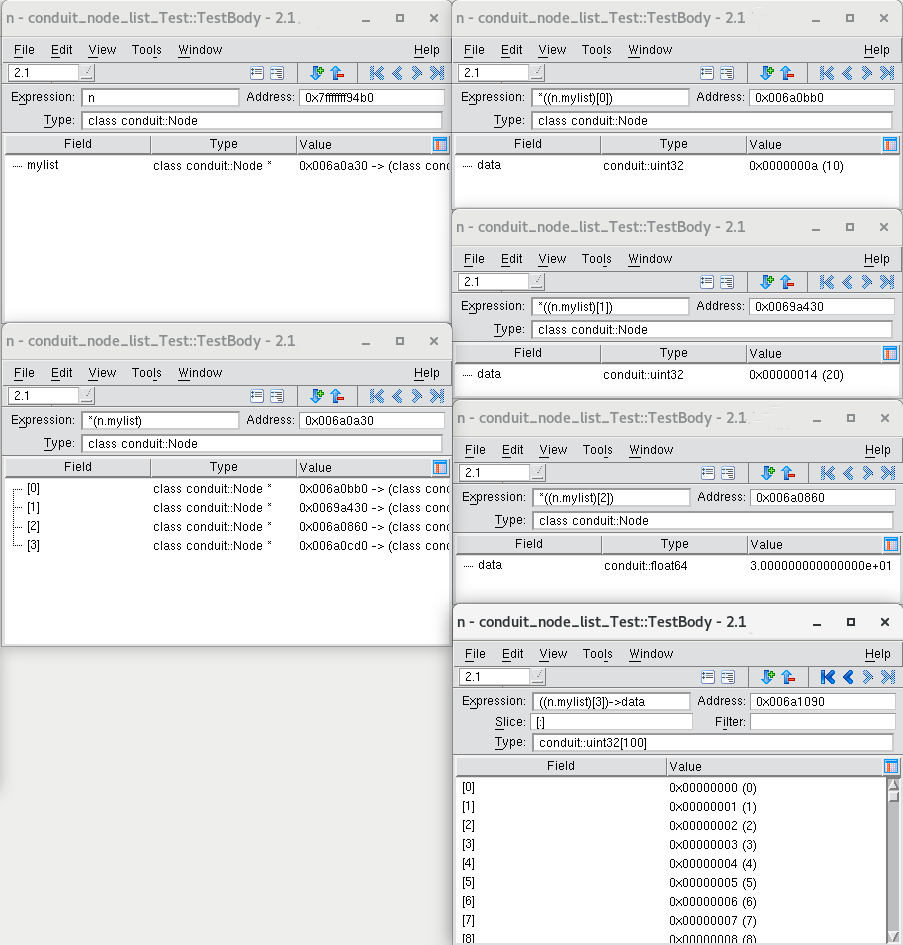

.. # Copyright (c) Lawrence Livermore National Security, LLC and other Conduit
.. # Project developers. See top-level LICENSE AND COPYRIGHT files for dates and
.. # other details. No copyright assignment is required to contribute to Conduit.

============================================
Debugger Integration
============================================

Conduit provides files to display Nodes more intuitively within the MS Visual Studio, Totalview, and GDB debuggers.  This complements Conduit's exensive support for writing Nodes as text and to various file formats.

MS Visual Studio
----------------

MS Visual Studio uses `XML files`_ with the extension .natvis to display custom classes.  The file ``conduit\src\debug\msvs\ConduitNode.natvis`` will allow Visual Studio to display most Nodes properly.  If you used CMake (stand-alone or through Visual Studio) to generate the project files, ConduitNode.natvis should already be added to the conduit project file.  If you need to add the .natvis file to an existing project, follow the `instructions`_ on Microsoft's web page for .natvis files.

.. _XML files: https://learn.microsoft.com/en-us/visualstudio/debugger/create-custom-views-of-native-objects

.. _instructions: https://learn.microsoft.com/en-us/visualstudio/debugger/create-custom-views-of-native-objects#add-a-natvis-file-to-a-c-project

The screenshot above shows how Visual Studio shows scalar, array, list, and object Nodes.

Because of limits on what a .natvis file can do, adding and removing child Nodes from an object Node can get the object in a state where the .natvis cannot understand it and shows incorrect data.  If you don't remove child Nodes from an object, the visualizer should show the correct data structure.

Totalview
---------

To display custom C++ objects, Totalview `requires you`_ to compile some extra functions into your code.  To display a Node, Conduit provides ``int TV_ttf_display_type ( const conduit::Node *n )`` in ``conduit/src/libs/conduit/debug/conduit_node_totalview.cpp``.  To configure Conduit with Totalview support, specify the Totalview directory, which must contain ``include/tv_data_display.h``, on your CMake command line by adding ``-DTOTALVIEW_DIR=/full/path/to/totalview``.  This will add conduit_node_totalview.cpp to the build, add TOTALVIEW_DIR/include to the search path, and add the file TOTALVIEW_DIR/src/tv_data_display.c to the build.  Totalview states that tv_data_display.c must only be compiled once in an executable for things to work right.  If you compile Conduit with Totalview support within another application that already builds in tv_data_display.c, add ``-DCONDUIT_EXCLUDE_TV_DATA_DISPLAY=1`` to exclude that file from Conduit's build.

.. _requires you: https://help.totalview.io/classicTV/current/HTML/index.html#page/Reference_Guide/cppview.html

Totalview can display Nodes with scalar, array, string, list, and object data.  Here is a screenshot of a the main window of a Totalview session stopped with a Node ``n`` in scope.

On the left, the top window shows the contents of ``n``, a child Node named "mylist."  Lower left shows the contents of ``n["mylist"]``, a list of four Nodes.  Diving into each of the four nodes produces the windows on the right, showing the values of each.

GDB
---

GDB uses Python routines to display custom objects.  Configure and build a debug build of Conduit.  From within GDB, load ``conduit/src/debug/gdb/conduit-gdb.py``.

The GDB debugger helper works in principle like the MSVS .natvis file.  At present, it is a work in progress (object Nodes don't display properly).
